# Назначение и состав решения

**Сервис прогнозирования инцидентов инженерных коллекторов** решает задачу «8. ДЖКХ»
(АО «Москоллектор»):

- прогнозирует отказы датчиков, загазованность и подтопление моделями машинного обучения;
- оценивает риск пожара и несанкционированного доступа **индикаторами по правилам**. Подтверждённых
  пожаров и проникновений в данных нет, поэтому индекс переводится в вероятность проявления угрозы
  за 24 ч по истории: калибровка по архиву 2019–2026 годов;
- показывает диспетчеру кадры камер у места тревоги для проверки;
- помогает инженеру ТО планировать профилактические работы по регламенту и фактическому состоянию;
- помогает диспетчерам разобраться в потоке сигналов;
- формирует рекомендации по техническому обслуживанию и черновики заявок на работы.

Сервис **не заменяет диспетчера и не управляет оборудованием** (ТЗ §5). Он показывает риск, его
причины и предлагает действие. Решение принимает человек, и его решение возвращается в систему как
обратная связь для моделей.

Решение — самостоятельная информационная система:

- разворачивается одной командой `docker compose up`;
- не зависит от внешних платных сервисов;
- готово к встраиванию в инфраструктуру заказчика через REST API, Kafka, LDAP/AD, PostgreSQL и
  адаптеры источников данных. Для систем заказчика написаны боевые адаптеры: help desk по REST,
  реестр оборудования по API и файлом, видеонаблюдение, AD. Они включаются в `.env` без правки кода.
  **На стенде вместо систем заказчика работают эмуляторы (mock)**: система учёта заявок, AD, реестр
  оборудования, видеонаблюдение, журналы ОДС. Настоящая внешняя интеграция на стенде — открытый API
  погоды. Состояние всех интеграций видно на странице «Интеграции». Подробности — в разделе
  «Эмуляция на стенде».

## Что внутри

| Контур | Что делает |
|---|---|
| Приём данных | Исторические журналы СМВУ (CSV/XLSX) и живой поток через Kafka; единая нормализация «сырых» значений в состояния каналов |
| Хранение | Оперативный контур (TimescaleDB), архив (Parquet), суточные витрины |
| Качество данных | Отчёт о загрузке, Data Health Score каждого канала, детектор «молчащих» каналов |
| Поток сигналов | Склейка сигналов в эпизоды, гипотезы первопричины, операционный приоритет, чек-лист действий |
| Прогнозы | Модели отказа датчика, превышения метана и подтопления (LightGBM); индикаторы пожара и НСД (правила); горизонт 24 ч, у модели отказа датчика также 7 суток |
| Вертикаль управления | Роли, команды, зоны ответственности, правило «кто первым откликнулся, того и карточка», перехват руководителем, эскалация по таймауту, уведомления |
| Мониторинг | Главный экран каждой роли: карта местности с зоной ответственности в акценте, объекты и датчики, карточки и заявки по роли, объекты вне зоны постранично; пять режимов раскраски |
| Зоны и структура | Зоны ответственности на карте, смежность, объекты по контуру здания (автовыделение с правкой), датчики, назначение сотрудников, командирование в другую зону |
| Рабочие места | Страница роли: схема коллекторов по пикетам со слоем роли, счётчики и очередь роли |
| Обслуживание | Рекомендации по ТО, черновики заявок, передача в систему учёта заявок (на стенде — эмулятор), статусы и отчёт бригады |
| Обучение | Решения диспетчеров → метки → дообучение; окно аналитика для контроля и отмены меток |
| Аналитика | Эффективность диспетчеров, «кто первый» по сотрудникам и командам, качество прогнозов, отчёты PDF/XLSX, дашборды Grafana |
| История и разбор | Показания объекта и канала за любой период с 2019 года; сценарный анализ любого эпизода: как система отработала бы его |
| Учебный контур | Отдельная база с полигоном, симулятор датчиков в полевом контуре, учебные задания по ролям с проверкой по действиям |
| Учения | Руководитель настраивает сценарий, осложнение и участников («молчащий» — проверка эскалации), старт по кнопке или таймеру, досрочная остановка, разбор с проверками и хронологией |
| Вики и сообщения | Справка для сотрудников (регламенты, памятки по ролям, риски), правится в админке; лента сообщений под колокольчиком |
| Телефон и планшет | Адаптивная вёрстка от 360 px, установка на главный экран; бригада исполняет заявки с телефона |
| Безопасность | TLS, роли и зоны, блокировка подбора пароля, короткие токены с отзывом, CSP; проверка всей системы с отчётом и чек-листом ввода в эксплуатацию |
| Поставка | Развёртывание на серверах заказчика настройками `.env`: своё имя и сертификат, AD, внешний слушатель Kafka для шлюза СМВУ; комплект образов для закрытого контура, скрипт проверки после установки; проверено репетицией развёртывания |

## Ключевые результаты на данных заказчика

Использованы журналы СМВУ за 2019–2026 годы (2021 год исключён по указанию заказчика): около
14 ГБ, 11 485 каналов, 95 объектов.

| Показатель | Результат |
|---|---|
| Сжатие потока сигналов | 30 суток: 90 250 сигналов → 2 138 карточек-эпизодов (×42) |
| Модель отказа датчика, тест 2026 года | ROC-AUC 0,90; уровень «высокий»: точность 0,21 при доле событий 0,6 % (в 33 раза точнее случайного); упреждение — медиана 12 ч |
| Модель газа, тест 2026 года | уровень «высокий» ловит 74 % превышений 1 % метана (простое правило — 39 %) |
| Бэктест за июнь 2026 года | реализованная точность: отказ датчика 0,20, газ 0,13, подтопление 0,15; полнота по факту: 18 %, 93 %, 43 % |
| Производительность | прогноз по всем объектам — около 5 с за цикл; 20 одновременных пользователей — медиана ответа 47 мс |
| Качество кода | 242 автотеста (226 платформы и 16 симулятора), линтеры ruff и oxlint, строгая типизация TypeScript, bandit, pip-audit и npm audit без уязвимостей |

Цели ТЗ «точность > 0,7 и полнота > 0,5 одновременно» на этих данных недостижимы. Причины — в
данных: события редки (доли процента каналов в сутки), журналов ремонтов нет, метки слабые. Как
выбраны уровни риска и какие показатели достигнуты, описано в главе о прогнозе отказа датчиков.

## Соответствие требованиям ТЗ

| Раздел ТЗ | Требование | Реализация |
|---|---|---|
| §6 | Вероятность инцидента, горизонт ≥ 24 ч, локация, тип | Журнал прогнозов: вероятность, горизонт 24 ч (у модели отказа датчика также 7 суток), объект, канал, пикет, тип; схема по пикетам |
| §6 | Сценарный анализ (пожар, проникновение, подтопление) | Модели газа и подтопления, индикаторы пожара и НСД (правила, не модели), «Разбор эпизода», «История» |
| §6 | Превентивные уведомления | Прогнозные карточки и уведомления в реальном времени (WebSocket) от уровня «высокий» |
| §3, §18 | Поддержка планирования профилактических работ; рекомендации против реальных | Графики ТО и ТР и ППР в формах заказчика по реестру и регламенту; регламент выведен из реальных графиков 2026 года; сверка: периодичность совпала в 91 % строк, нагрузка по месяцам ровнее (пик 47 работ против 62) |
| §7, §14 | Форматы обмена, интеграция в любые системы | Конструктор: шаблон формата (JSON, CSV, строка), песочница с нормализацией, приём от шлюза по HTTP и Kafka без программиста |
| §6 | Рекомендации по ТО, реестр оборудования | Рекомендации из прогнозов, Data Health, просрочки ТО и фактического состояния; план ТО инженера ТО; реестр — синхронизация по API или файлом CSV/XLSX, на стенде эмулирован |
| §6 | Получение статусов из системы учёта заявок | Передача заявки и синхронизация статусов, отчёт бригады. Адаптер help desk настраивается в `.env` (токен, пути, карта статусов), на стенде — эмулятор `mock-helpdesk` |
| §3 | Технический персонал, планирование профилактических работ | Роль «Инженер ТО»: план по регламенту и состоянию, постановка работ в план на дату, реестр с осмотрами, выгрузка плана в XLSX; бригада отмечает фактическое состояние оборудования |
| §7 | CSV, XLSX, API JSON/XML, PostgreSQL, GeoJSON/WKT | Импорт CSV/XLSX; REST API JSON и XML; PostgreSQL 16; схема в GeoJSON и WKT |
| §8 | Статистика, сезонность, дообучение, черновики заявок, отчёты PDF/XLSX | Раздел «Аналитика» (включая метрики сотрудников и команд), погода и календарь, модуль обратной связи и переобучения, отчёты |
| §9, §11 | Прогноз для объекта ≤ 300 с; поток ≤ 300 с | Цикл прогноза по всем объектам — около 5 с; метрика задержки потока в Prometheus |
| §11 | ≥ 20 пользователей без деградации | Нагрузочная проверка: 20 пользователей — медиана 47 мс (один пользователь — 45 мс), ошибок нет |
| §11 | Резервное копирование, восстановление ≤ 4 ч | Ежедневный pg_dump с ротацией, проверенная процедура восстановления |
| §11 | TLS 1.2+, LDAP/AD, RBAC, журнал действий | Caddy TLS, django-auth-ldap (на стенде — тестовый OpenLDAP вместо AD заказчика), 8 ролей и зоны ответственности, вход в Grafana и Prometheus через учётную запись системы, журнал действий и просмотров, блокировка подбора пароля, CSP; отчёт о проверке безопасности |
| §11 | Linux, Chrome / Яндекс.Браузер, PostgreSQL ≥ 12 | Контейнеры Linux; интерфейс на Chromium-браузерах; PostgreSQL 16 + TimescaleDB |
| §12 | Пути «пожар» и «подтопление» | Карточка с вероятностью, локацией и горизонтом (у подтопления — модель, у пожара — индекс, откалиброванный по истории) → проверка, в том числе по камерам у места тревоги → решение с причиной → метка для дообучения |
| §13 | Внешние метеоданные, режим «только чтение», контуры хранения | Open-Meteo; интеграции только на чтение; оперативный контур, архив, витрины |
| §14 | Методы, ограничения, сборка, архитектура, библиотеки | Настоящий документ |

# Функциональная архитектура

## Пользователи и роли

| Роль | Зона | Что делает в системе |
|---|---|---|
| Диспетчер ОДС | весь район | Следит за рабочим местом и потоком, первым откликается на карточки, принимает решения, эскалирует, создаёт черновики заявок |
| Диспетчер подразделения | свой объект | То же в своей зоне; первым получает карточки своего объекта |
| Руководитель подразделения | своё поддерево | Утверждает заявки, видит эскалации, аналитику и отчёты |
| Аналитик | весь район | Модели и их переобучение, калибровка индикаторов, правила разметки, проверка меток, качество данных, отчёты, бизнес-панели Grafana |
| Ремонтная бригада | свои заявки | Исполнение заявок: свои заявки на схеме трассы, «взять в работу» и «выполнена» с отчётом и фактическим состоянием оборудования |
| Инженер ТО | своё поддерево | План профилактических работ по регламенту и состоянию, постановка работ в план (черновики заявок на дату), реестр оборудования, осмотры, выгрузка плана |
| Администратор | вся система | Пользователи, справочники, профили нормализации, настройки, интеграции, мониторинг системы (Grafana, Prometheus) |
| Наблюдатель | своё поддерево | Только просмотр |

**Командная вертикаль:** бригада → диспетчерская объекта → ОДС → руководство.

- Карточка приходит ближайшему уровню, к которому прикреплены люди.
- Если за время реакции её никто не взял, она эскалируется на уровень выше. Время реакции для
  уровня «критический» — 5 минут, для «высокий» — 15 минут.
- Действует правило смены: карточку забирает тот, кто первым откликнулся — принял, взял в работу,
  отметил шаг, принял решение или составил заявку. Второй диспетчер получает отказ с именем того, кто
  успел раньше. Перехватить карточку может только руководитель, перехват записывается в хронологию.
- Кто первым заметил и кто первым откликнулся, фиксируется в карточке и попадает в метрики сотрудников.

## Основной путь диспетчера

1. **Мониторинг** — карта зоны ответственности: объекты в цвете обстановки, бейджи карточек и
   заявок; щелчок по объекту — его карточки, заявки и датчики не в норме. **Рабочее место**
   диспетчера: схема зоны по пикетам, счётчики, очередь «требуют действия», активные риски по пяти
   задачам и «Мои показатели». Поток «сырые сигналы → эпизоды → требуют
   действия» — на экране «Оперативная обстановка».
2. **Карточка эпизода** содержит:
   - сколько сигналов и каналов склеено;
   - гипотезы первопричины с весами;
   - операционный приоритет 0–100;
   - чек-лист действий;
   - кто уже смотрел карточку.
3. **Решение** начинается с ответа «что произошло»: неисправность датчика, потеря связи,
   обесточивание, ложное срабатывание, внешнее воздействие, работы на объекте, реальное событие,
   недостаточно данных. Далее — вид решения, причина из справочника и комментарий. Для прогнозной
   карточки добавляется вопрос «помог ли прогноз».
4. **Заявка:**
   - черновик из карточки или рекомендации;
   - утверждение руководителем;
   - передача в систему учёта заявок;
   - статусы и отчёт бригады приходят обратно.
5. Решение становится **меткой для дообучения** по правилам, которые настраивает аналитик.

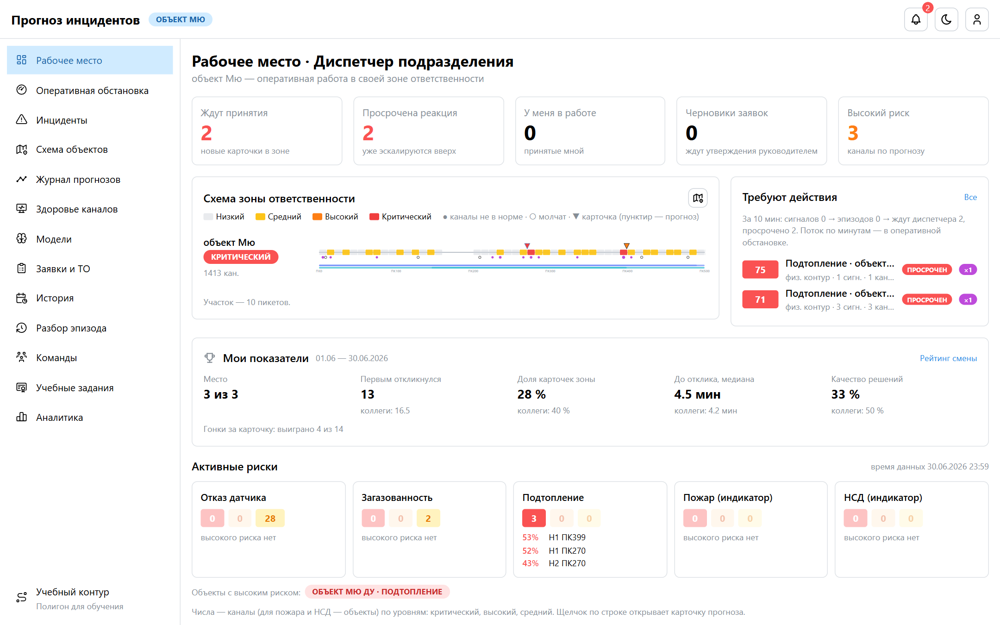

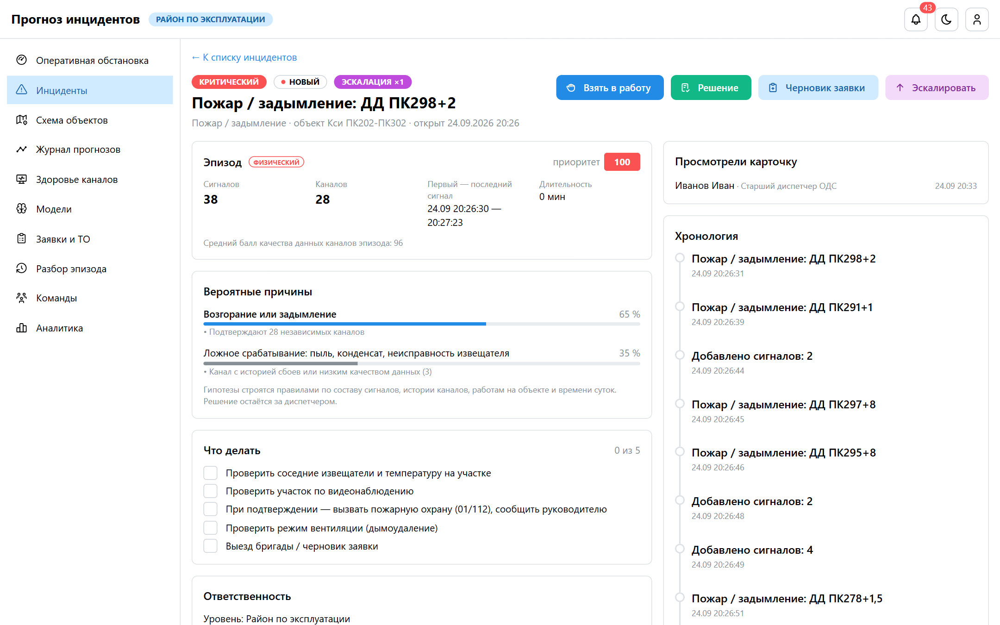

## Экраны

| Экран | Назначение |
|---|---|
| Мониторинг | Карта зоны ответственности: объекты в цвете режима, бейджи карточек и заявок, датчики объекта, объекты вне зоны постранично |
| Зоны и объекты | Редактор зон, объектов (автовыделение здания), датчиков, сотрудников и командирований |
| Рабочее место | Своё у каждой роли: схема со слоем роли (риск, Data Health, состояние, заявки), счётчики и очередь роли |
| Оперативная обстановка | Поток сигналов, эпизоды, очередь «требуют действия», активные риски, объекты с высоким риском |
| Инциденты | Очередь карточек по операционному приоритету, фильтры |
| Карточка инцидента | Эпизод, гипотезы, чек-лист, ответственность, сигналы, хронология, просмотры, решение, заявка, эскалация |
| Схема объектов | Трассы коллекторов по пикетам: участки с цветом риска, каналы не в норме, молчащие каналы, карточки |
| Журнал прогнозов | Прогнозы и индикаторы с исходами, оперативный журнал и бэктест, список наблюдения |
| Карточка прогноза | Факторы (SHAP), надёжность уровня, качество данных и история канала, связанные карточки, рекомендации |
| Здоровье каналов | Data Health Score, молчащие каналы, составляющие оценки |
| Модели | Версии моделей по задачам, метрики на тесте, обучение, активация, бэктест |
| Обучение и обратная связь | Влияние решений диспетчеров на модели, очередь меток, правила разметки, настройки переобучения |
| Заявки и ТО | Рекомендации по ТО, заявки и их путь в системе учёта заявок |
| История | Объект — каналы по суткам; канал — показания, состояния, карточки и решения того времени, прогнозы |
| Разбор эпизода | Как система отработала бы любой интервал истории до 24 часов |
| Аналитика | Эффективность диспетчеров, «кто первый» по сотрудникам и командам, качество прогнозов, отчёты PDF/XLSX |
| Учебные задания | Задания по ролям с панелью задания поверх экранов, экскурсия по интерфейсу, результаты сотрудников |
| Учения | Настройка учений, ход в реальном времени, досрочная остановка, разбор: проверки, участники, хронология |
| Вики | Регламенты, памятки по ролям, риски, обучение, глоссарий, частые вопросы; поиск; правка в админке |
| Сообщения | Лента уведомлений под колокольчиком: карточки, эскалации, заявки, учения |
| Команды | Состав команд, зоны ответственности, командная вертикаль |
| Загрузка и качество данных | Импорт справочников и журналов, отчёт о качестве загрузки |

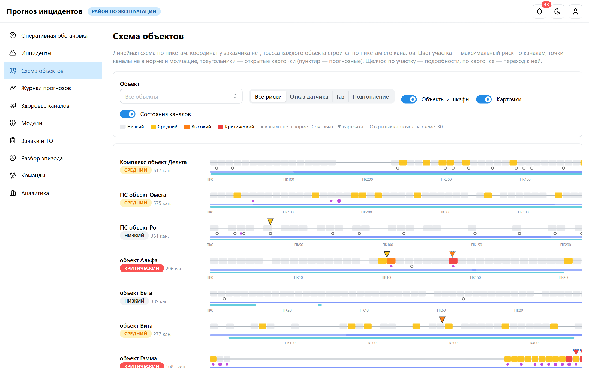

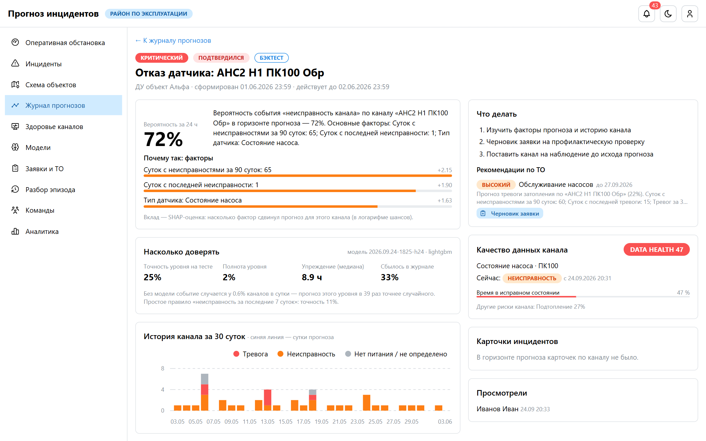

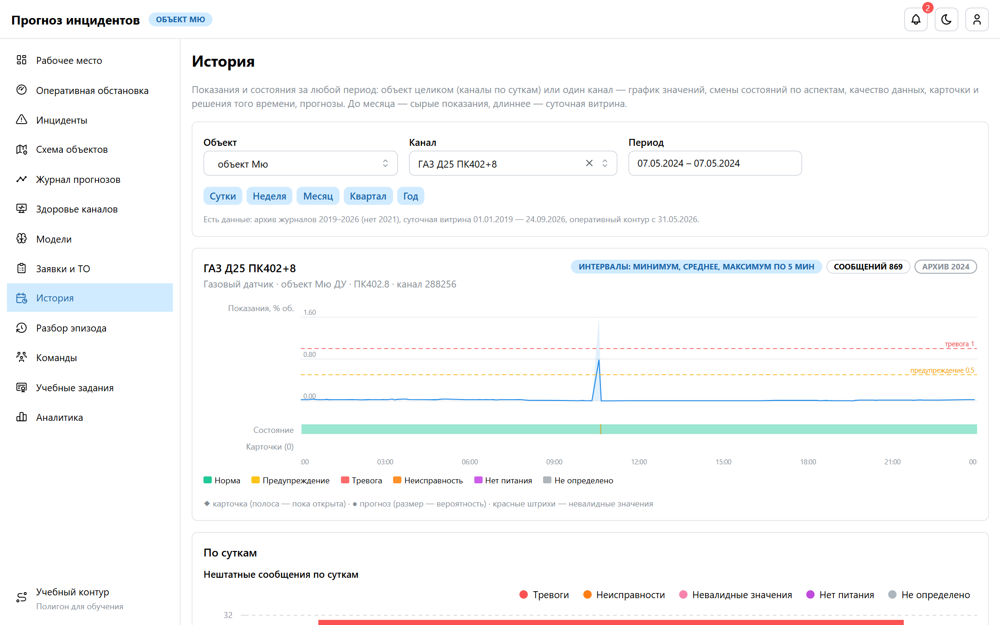

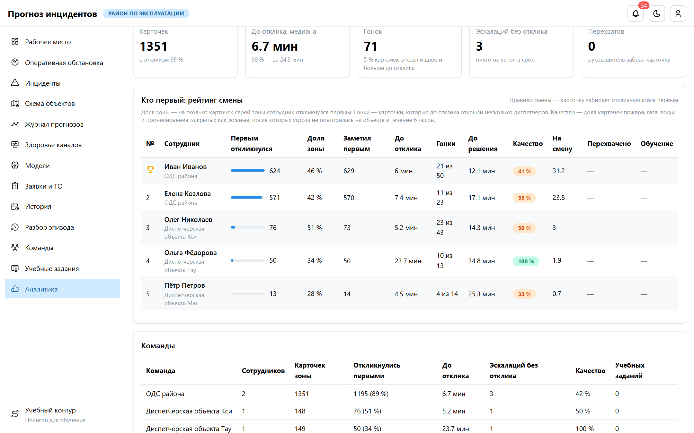

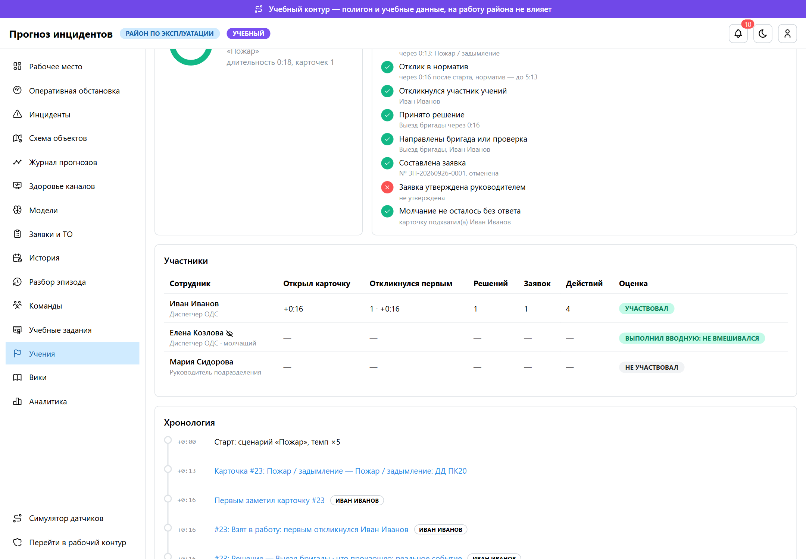

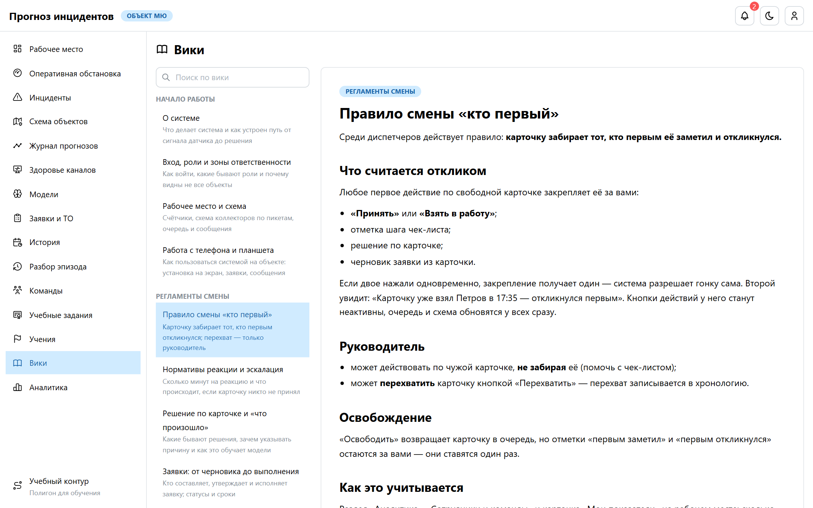

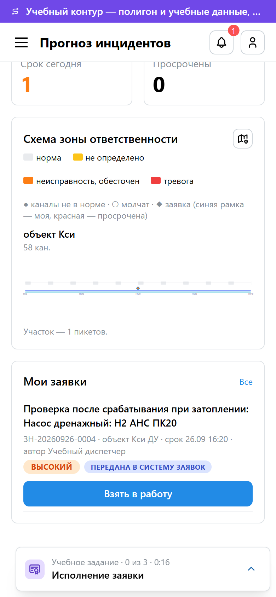

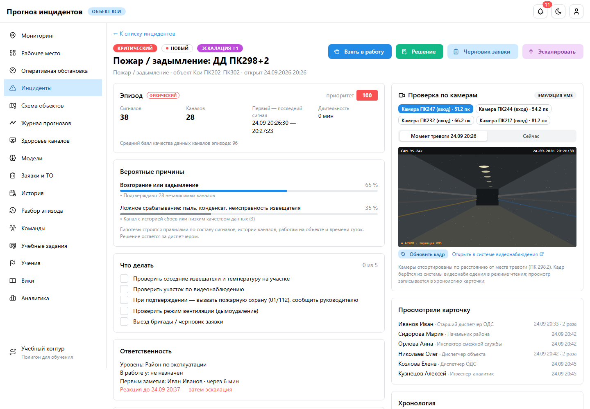

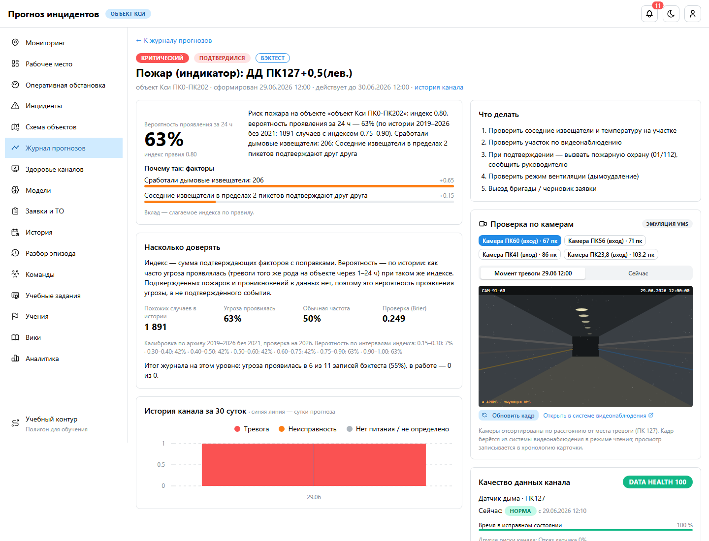

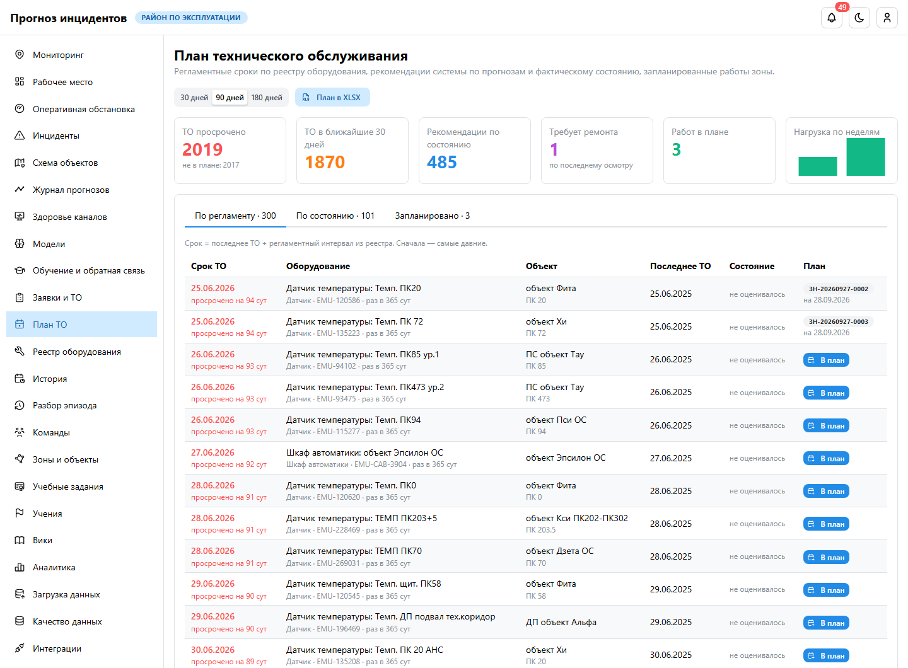

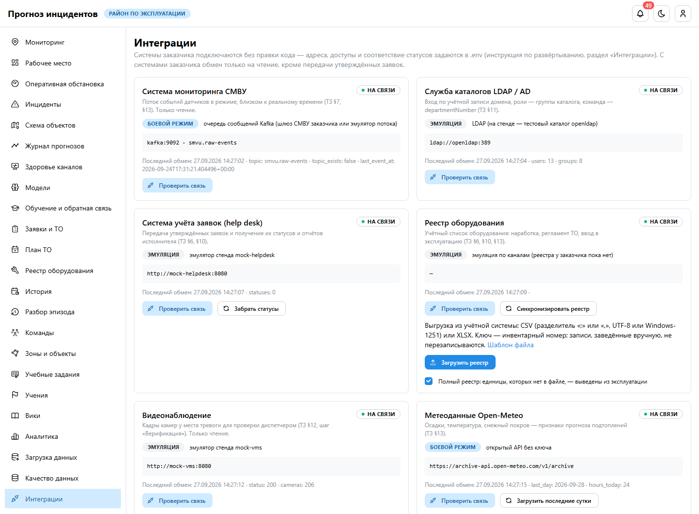

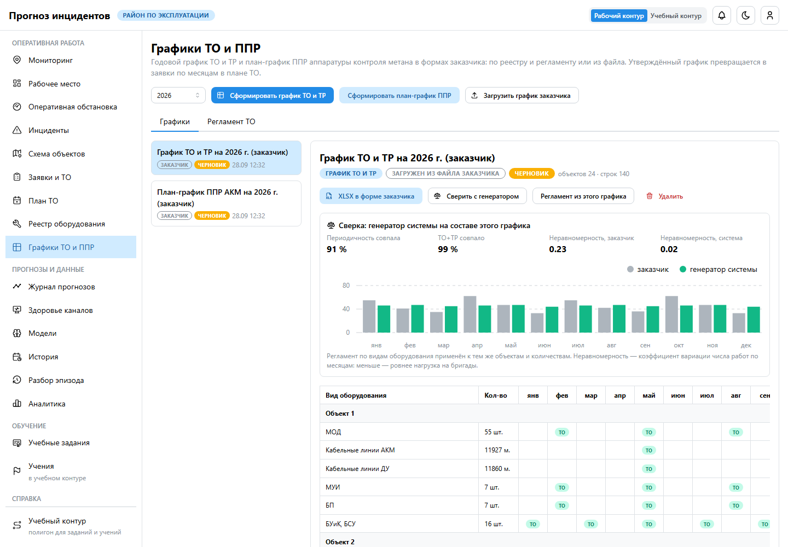

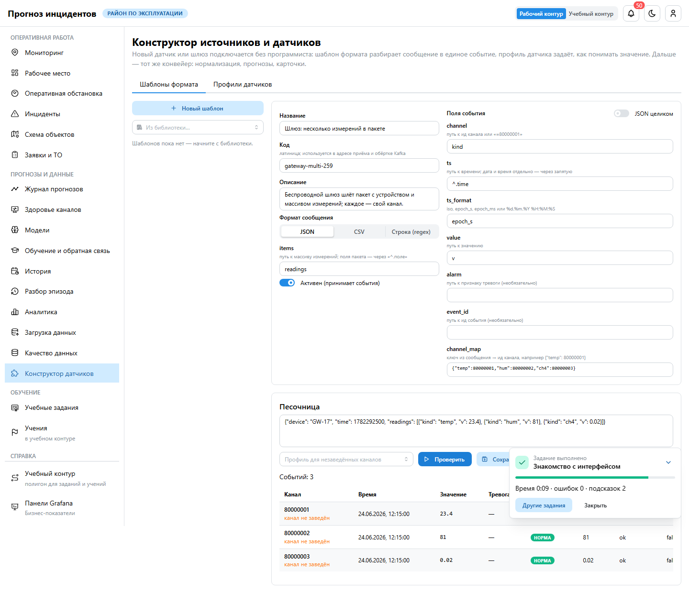

# Компонентная архитектура

## Состав контейнеров

Всё решение описано в одном файле `docker-compose.yml`:

| Сервис | Роль |
|---|---|
| `web` | Caddy: TLS, раздача интерфейса (React), проксирование API, Grafana и help desk |
| `backend` | Django + DRF (ASGI, uvicorn, 4 процесса): REST API, админка, WebSocket |
| `worker` | Celery: фоновые задачи (импорт, обучение, прогноз, рекомендации) |
| `beat` | Celery beat: расписание периодических задач |
| `consumer` | Консьюмер Kafka: поток СМВУ → нормализация → хранение → правила |
| `migrate` | Одноразовый запуск: миграции, роли, справочники, расписания, демо-состав |
| `db` | PostgreSQL 16 + TimescaleDB |
| `redis` | Брокер Celery, кеш, слой каналов WebSocket |
| `kafka` | Поток событий (KRaft) |
| `openldap` | Тестовый каталог LDAP вместо AD заказчика |
| `mock-helpdesk` | Эмулятор системы учёта заявок заказчика |
| `mock-vms` | Эмулятор системы видеонаблюдения: кадры камер для проверки тревоги |
| `grafana-init` | Однократно выставляет права папок Grafana: «Система» — администратору, «Аналитика» — аналитику |
| `prometheus`, `grafana`, экспортёры | Мониторинг системы и бизнес-показателей |
| `backup` | Ежедневные резервные копии БД с ротацией |
| `replay` (профиль `demo`) | Воспроизведение журнала СМВУ как живого потока |
| `migrate-training`, `backend-training`, `worker-training`, `consumer-training` (профиль `training`) | Учебный контур: тот же образ, своя база `collector_training`, тема Kafka, Redis-индекс; вместо справочников заказчика — полигон |
| `mock-helpdesk-training` (профиль `training`) | Эмулятор системы учёта заявок учебного контура |
| `simulator` (профиль `training`) | Симулятор датчиков СМВУ: консоль и веб, сеть `field`, видит только Kafka |

<!-- include: ../architecture.md strip-title -->

<!-- include: ../adr/0001-storage-contours.md shift=1 -->

<!-- include: ../data-methodology.md -->

<!-- include: ../correlation.md -->

<!-- include: ../forecasting.md -->

<!-- include: ../scenarios.md -->

<!-- include: ../analytics.md -->

<!-- include: ../history.md -->

<!-- include: ../integrations.md -->

<!-- include: ../maintenance.md -->

<!-- include: ../constructor.md -->

<!-- include: ../../simulator/README.md -->

<!-- include: ../monitoring.md -->

<!-- include: ../platform.md -->

<!-- include: ../training.md -->

<!-- include: ../wiki.md -->

<!-- include: ../mobile.md -->

# Проверка достоверности

Все метрики получены на данных заказчика. Их можно воспроизвести на стенде:

| Что проверяется | Как | Где смотреть |
|---|---|---|
| Прогноз против факта | Валидация строго по времени: обучение 2019–2024 (без 2021), подбор порогов на 2025, отложенный тест 2026 | «Модели» → метрики версии; `train_model --task …` |
| Работа в режиме прогноза | Бэктест: прогноз раз в сутки за период, исход проставляется по факту | «Журнал прогнозов» → «Бэктест»; `forecast --backtest …` |
| Полнота по факту | Доля начавшихся событий периода, заранее предупреждённых прогнозом уровня «высокий» и выше | «Аналитика» → «Качество прогнозов» |
| Совпадение признаков в обучении и работе | Признаки одного канала-дня, посчитанные двумя путями, сравниваются; расхождений нет | Глава о сценариях рисков |
| Сжатие потока и гипотезы | Сценарный разбор любого эпизода истории теми же функциями, что работают в системе | «Разбор эпизода» |
| Сквозная работа | Три демо-сценария на настоящих эпизодах из журналов: поток проходит весь конвейер | Приложение «Демо-сценарии» |
| Производительность | Нагрузочный прогон `docs/delivery/load_test.py` | Раздел «Производительность» ниже |

**Сводка по моделям** (отложенный 2026 год, уровень «высокий»):

| Задача | ROC-AUC | Точность | Полнота | Сигналов в сутки | Простое правило: точность / полнота |
|---|---|---|---|---|---|
| Отказ датчика | 0,90 | 0,21 | 0,09 | 32 | 0,10 / 0,45 |
| Загазованность (≥ 1 % метана) | 0,94 | 0,08 | 0,74 | 20 | 0,07 / 0,39 |
| Подтопление | 0,83 | 0,15 | 0,45 | 21 | 0,13 / 0,54 |

Как читать эти цифры:

- Точность 0,21 при доле событий 0,6 % означает, что прогноз уровня «высокий» в 33 раза точнее
  случайного выбора канала.
- Уровень «критический» у отказа датчика даёт точность 0,25 при 5 сигналах в сутки. Он предназначен
  для немедленной реакции, «высокий» — для планирования проверки.
- Индикаторы пожара и НСД: индекс по правилам переводится в вероятность проявления угрозы за 24 ч
  калибровкой по архиву (индекс считается по истории теми же правилами, шаг час). На отложенном
  2026 годе у пожара Brier 0,249 против 0,296 для постоянной частоты: индекс разделяет случаи
  (7 % → 42 % → 63 %). У НСД тревоги доступа повторяются в 78 % случаев независимо от индекса, поэтому
  вероятность почти постоянна. Для НСД главное — проверка, в том числе по камерам.

## Производительность

| Требование ТЗ | Результат на стенде (4 ядра, 8 ГБ памяти для Docker) |
|---|---|
| Прогноз для объекта ≤ 300 с | Цикл прогноза по всем объектам и пяти задачам — около 5 с |
| Задержка потока ≤ 300 с | Консьюмер пишет пачку за доли секунды. Задержка «время события → запись» публикуется метрикой `ingestion_event_lag_seconds` |
| ≥ 20 пользователей без деградации | 20 пользователей с паузами 1–5 с между действиями: медиана 47 мс, 95 % — 212 мс, ошибок нет. Один пользователь: медиана 45 мс |
| Стресс | 20 пользователей без пауз: 75 запросов в секунду, медиана 171 мс, 95 % — 618 мс, ошибок нет |
| Восстановление ≤ 4 ч | Полная копия БД — 18 с (117 МБ). Восстановление в чистую базу — 14 с без ошибок, число строк совпало во всех таблицах |

# Условия и ограничения

**Данные**

- Используются журналы СМВУ за 2019–2026 годы. 2021 год исключён: по словам заказчика, всплеск
  тревог в нём вызван переходом на новую систему мониторинга.
- Журналов ОДС, решений диспетчеров, ремонтов и реестра оборудования в выгрузке нет. Поэтому:
  - меткой отказа служит начало неисправности в журнале СМВУ — это слабая метка;
  - реестр оборудования эмулирован: средние наработки на отказ взяты из открытых источников;
  - решения диспетчеров начинают копиться с началом работы системы.
- Подтверждённых пожаров и проникновений в данных нет. Пожар и НСД оцениваются
  индикаторами-правилами, а не обученными моделями. Их исход — «угроза проявилась», а не
  подтверждённое событие.
- Координат объектов нет. Схема строится по пикетам каналов: пикеты есть у 10 647 из 12 622 каналов.
  Для карты мониторинга контуры объектов и зон задаются в редакторе «Зоны и объекты». На стенде
  объекты условно привязаны к реальным зданиям OSM одного района Москвы.
- Данные на стенде заканчиваются 30.06.2026. Прогноз строится на «время данных» — конец последних
  полных суток. На живом потоке прогноз идёт на текущий момент.

**Модели**

- Цель ТЗ «точность > 0,7 и полнота > 0,5 одновременно» при редких событиях и слабых метках
  недостижима. Уровни риска выбраны по точности на 2025 годе, каждый уровень показывает свою
  точность, полноту и нагрузку.
- Прирост от погоды для подтопления — в пределах шума: тревоги насосов определяются в основном
  поведением станций.
- Упреждение считается только для отказа датчика: у суточных событий газа и подтопления нет
  точного времени начала.

**Эмуляция на стенде (mock)**

Системы заказчика на стенде эмулированы, это разрешено заказчиком. Для каждой написан боевой
адаптер. Он включается в `.env` (`HELPDESK_MODE`, `REGISTRY_MODE`, `VMS_MODE`, `LDAP_*`), а
проверить связь можно на странице «Интеграции». Настоящие внешние интеграции на стенде — открытые
сервисы на чтение: API погоды Open-Meteo и OpenStreetMap для карты мониторинга (подложка и контуры
зданий).

| Компонент | Что заменяет | Как отмечено |
|---|---|---|
| Поток СМВУ | живой поток системы мониторинга | воспроизведение настоящих журналов через Kafka (`replay`, `demo_scenario`) |
| Симулятор датчиков | полевое оборудование учебного полигона | `simulator/`, отдельный полевой контур; полигон — вымышленные объекты и каналы |
| Система учёта заявок | help desk заказчика | эмулятор `mock-helpdesk` |
| LDAP | AD заказчика | тестовый OpenLDAP с демо-составом |
| Смены диспетчеров, данные ОДС | журналы ОДС и история работы диспетчеров | команда `emulate_shifts`, пометка «эмуляция»; в обучение не попадает |
| Реестр оборудования | учётная система заказчика | эмуляция при загрузке справочников: наработки на отказ из открытых источников, источник «эмуляция»; заменяется выгрузкой CSV/XLSX или синхронизацией по API |
| Видеонаблюдение | система видеонаблюдения заказчика | эмулятор `mock-vms` (синтетический кадр со штампом камеры и времени); камеры расставлены командой `seed_cameras` |

При подключении к настоящим системам меняются только адаптеры и клиенты: ядро не зависит от источника.

**Учебный контур**

- Два ученика на одном объекте полигона мешают друг другу: для группового обучения им назначают разные
  объекты через зоны ответственности.
- Модели в учебном контуре не переобучаются, прогнозы отказа на полигоне почти не формируются: у полигона
  нет истории. Индикаторы пожара и НСД работают, потому что опираются на живой поток.

**Метрики сотрудников**

- Качество решения оценивается косвенно: повтор физической угрозы на объекте в течение 6 часов после
  закрытия как ложной. Подтверждённого итога (акта выезда) в данных нет.
- На стенде метрики показаны на эмуляции смен, где гонка дежурных разыграна со случайными задержками.

**Границы по ТЗ §5.** Система не принимает решений за диспетчера и не управляет оборудованием.
Исполнитель заявки (бригадир зоны) подставляется только в момент утверждения заявки руководителем.

# Установка, сборка и запуск

## Требования

| Ресурс | Минимум |
|---|---|
| ОС сервера | Linux x86-64 (любая с Docker); для разработки подходит также Windows или macOS с Docker Desktop |
| Docker | Docker Engine 24+ с Compose v2 |
| Процессор / память | 4 ядра, не менее 8 ГБ памяти для контейнеров |
| Диск | около 25 ГБ при полном импорте истории: исходные журналы 14 ГБ, архив около 3 ГБ, БД около 2 ГБ |
| Браузер | актуальные Google Chrome или Яндекс.Браузер |

## Сборка и первый запуск

```bash
git clone <репозиторий> && cd collector_incident_forecast
cp .env.example .env              # пароли, порты, DEMO_USERS, HELPDESK_STAGE_MINUTES
docker compose up -d --build      # первая сборка 5–10 минут
docker compose --profile training up -d --build   # учебный контур и симулятор (по желанию)
```

При запуске одноразовый контейнер `migrate`:
- применяет миграции;
- создаёт роли, таксономию состояний, политики эскалации и уровни риска, справочник причин решений,
  правила разметки и расписания;
- создаёт суперпользователя и демо-состав команд.

Сборка идёт из исходного кода: образ backend — `backend/Dockerfile` (Python 3.12, зависимости по
`uv.lock`), интерфейс — `frontend/Dockerfile` (Node, Vite, итоговый Caddy).

| Адрес | Что |
|---|---|
| https://localhost | Интерфейс (сертификат локального центра Caddy — подтвердите исключение) |
| https://localhost/api/docs/ | REST API (OpenAPI / Swagger) |
| https://localhost/admin/ | Админка (открывается из меню «Администрирование» тем же входом) |
| https://localhost/grafana/ | Мониторинг и бизнес-показатели |
| https://localhost/helpdesk/ | Эмулятор системы учёта заявок |
| http://localhost:8081 | Kafka UI |
| https://localhost/training/ | Учебный контур (профиль `training`), вход общий |
| https://localhost/simulator/ | Симулятор датчиков (профиль `training`): руководителю учений из меню учебного контура; напрямую — http://localhost:8095 с этой машины |

Так запускается демо-стенд. Установка на серверы заказчика — своё имя сервера и сертификат, AD,
поток СМВУ, закрытый контур, обновление — описана в главе «Развёртывание на серверах заказчика» и
поставляется отдельной инструкцией.

Учётные записи: суперпользователь из `.env`; демо-сотрудники с паролем `Passw0rd!` (`ods.ivanov`,
`head.sidorova`, `analyst.kuznetsov` и другие — полный список в README). Демо-состав отключается
переменной `DEMO_USERS=false`.

## Загрузка данных

Данные заказчика кладутся в каталог `data/`, в репозиторий они не входят. Справочники из
`data/dataset/` загружаются автоматически при первом запуске. Журналы загружаются из интерфейса
(«Загрузка данных») или из консоли:

```bash
docker compose run --rm backend python manage.py import_history            # все годы, кроме 2021
docker compose run --rm backend python manage.py import_history --years 2025 2026
```

Импорт занимает 1–2 минуты на год. После первого импорта модель отказа датчиков обучается
автоматически. Остальные модели, бэктест, погода и демонстрационные данные:

```bash
docker compose exec worker python manage.py train_model --task gas          # также flood, sensor_failure
docker compose exec worker python manage.py forecast --backtest 2026-06-01T23:59:59+03:00 2026-06-29T23:59:59+03:00
docker compose exec backend python manage.py load_weather --from 2019-01-01 --to 2026-09-20 --recent
docker compose exec backend python manage.py emulate_shifts --from 2026-06-16 --to 2026-06-30
```

## Разработка и проверка кода

```bash
cd backend && uv sync && uv run pytest && uv run ruff check . && uv run ruff format --check .
cd frontend && npm install && npx tsc -b && npm run lint && npm run dev
```

Автотесты платформы (169) работают на SQLite без внешних сервисов; тесты симулятора (16) —
`cd simulator && uv run pytest`. Интерфейс в режиме разработки
проксирует API на `localhost:8000`.

<!-- include: ../deployment.md -->

# Эксплуатация и администрирование

## Периодические задачи

Расписание хранится в БД (django-celery-beat) и меняется в админке без перезапуска.

| Задача | Период |
|---|---|
| Эскалация карточек без реакции | 1 мин |
| Статусы заявок из системы учёта заявок | 1 мин |
| Цикл прогноза: состояние потока, Data Health, исходы прогнозов, прогнозы по всем задачам, индикаторы | 15 мин |
| Суточная витрина телеметрии | 1 ч |
| Погода Open-Meteo: последние сутки и прогноз | 6 ч |
| Рекомендации по ТО | 1 сут |
| Контроль деградации модели по журналу | 1 сут |
| Плановое переобучение (чемпион / претендент) | 1 нед |

## Настройки без изменения кода

- **Администратор:**
  - пороги уровней риска и горизонт по задачам;
  - время реакции и число уровней эскалации;
  - профили нормализации датчиков и правила состояний;
  - справочник причин решений;
  - команды, зоны ответственности, пользователи.
- **Аналитик** (окно «Обучение и обратная связь»):
  - правила разметки «что произошло / причина → эффект для обучения»;
  - проверка и отмена меток;
  - автоматическое переобучение и активация, порог деградации.

## Мониторинг

Prometheus собирает метрики HTTP и БД Django, консьюмера (задержка потока), Celery, PostgreSQL,
Redis и Caddy. В Grafana две папки:
- «Система» — состояние сервисов и очередей, только администратору;
- «Аналитика» — «Бизнес-показатели»: инциденты, реакция диспетчеров, качество прогнозов; видят
  аналитик и администратор.

Grafana и Prometheus открываются из меню системы, вход — через учётную запись системы. Caddy
проверяет сеанс и роль у бэкенда перед каждым запросом, отдельных паролей нет. Витрины Grafana
читает ролью БД только для чтения.

## Резервное копирование и восстановление

Контейнер `backup` ежедневно делает `pg_dump` в каталог `./backups`. Хранятся 7 ежедневных,
4 еженедельных и 3 ежемесячных копии.

Внеплановая копия:

```bash
docker compose exec backup /backup.sh
```

Восстановление (TimescaleDB требует обрамления `pre_restore` / `post_restore`):

```bash
docker compose stop backend worker beat consumer
docker compose exec db psql -U collector -d postgres -c "DROP DATABASE collector" -c "CREATE DATABASE collector"
docker compose exec db psql -U collector -d collector -c "CREATE EXTENSION timescaledb" -c "SELECT timescaledb_pre_restore()"
gunzip -c backups/last/collector-latest.sql.gz | docker compose exec -T db psql -U collector -d collector
docker compose exec db psql -U collector -d collector -c "SELECT timescaledb_post_restore()"
docker compose up -d
```

Каталог `artifacts/` (модели и Parquet-архив) копируется отдельно, например вместе с `backups/`.
Если он утерян:
- модели переобучаются командой `train_model`;
- архив пересобирается из исходных журналов командой `import_history`, около 15 минут на всю историю.

# Интеграция с другими системами

| Способ | Назначение |
|---|---|
| REST API (JSON и XML), OpenAPI 3 | Все данные и действия интерфейса: инциденты, решения, прогнозы, риски, схема (GeoJSON / WKT), заявки, отчёты. Аутентификация — JWT |
| Kafka, топик `smvu.raw-events` | Приём потока событий из системы мониторинга: формат события — ид канала, время, сырое значение, признак тревоги |
| Адаптеры источников | `ingestion/adapters`: CSV и XLSX журналов СМВУ, Parquet-архив. Новый источник — новый адаптер, ядро не меняется |
| Файлы CSV / XLSX | Импорт справочников и журналов из интерфейса и консоли |
| PostgreSQL | Прямой доступ к витринам на чтение (так подключена Grafana) |
| LDAP / AD | Вход сотрудников; из каталога берутся команда и зона ответственности. **На стенде — эмуляция:** тестовый OpenLDAP |
| Система учёта заявок | Передача заявки, чтение статусов и отчёта исполнителя. REST-адаптер: токен, пути, карта статусов в `.env`. **На стенде — эмуляция:** `mock-helpdesk` |
| Реестр оборудования | Синхронизация по API раз в сутки или загрузка CSV/XLSX; ключ — инвентарный номер. **На стенде — эмуляция** по каналам |
| Видеонаблюдение | Кадр камеры на момент тревоги и ссылка на поток, только чтение. **На стенде — эмуляция:** `mock-vms` |
| Open-Meteo | Погода по Москве (открытый API без ключа). Работающая интеграция |
| OpenStreetMap | Подложка карты мониторинга (векторные тайлы) и контуры зданий (Overpass API) для автовыделения объекта. Работающая интеграция на чтение; адреса заменяются на собственные серверы |
| Kafka, топик `sim.training-commands` | Команды учебных заданий симулятору датчиков (только учебный контур) |
| WebSocket | Уведомления в реальном времени для интерфейса и внешних клиентов |

Интеграции с системами заказчика работают только на чтение (ТЗ §13). Исключение — передача
утверждённой заявки в систему учёта заявок: этого требует сам процесс. Подключение к настоящим
системам заказчика на стенде не проверялось: они эмулированы (см. «Эмуляция на стенде»).

# Безопасность и защита информации

## Меры защиты (ТЗ §11)

- **Шифрование.** Весь внешний трафик идёт через TLS 1.2+ (Caddy); внутренние сервисы наружу не
  публикуются.
- **Аутентификация:**
  - LDAP / AD (django-auth-ldap) или локальные учётные записи;
  - JWT для API: доступ — 30 минут, обновление — 7 суток с ротацией и отзывом при выходе;
  - WebSocket — токен в заголовке протокола, не в адресе (не попадает в журналы);
  - сессии для админки (cookie только по HTTPS);
  - после 5 неудачных попыток входа учётная запись блокируется на 15 минут (API, админка, LDAP).
- **Разграничение доступа.** 8 ролей (Django Groups и права) и зона ответственности. Объекты вне зоны
  отфильтрованы на уровне запросов: API возвращает 404, а не 403, и не раскрывает их существование.
- **Журналирование:**
  - каждое изменяющее действие и бизнес-событие (решение, эскалация, переобучение, выгрузка отчёта)
    пишется в журнал действий, который нельзя изменить через админку;
  - просмотры карточек инцидентов и прогнозов фиксируются;
  - история изменений записей хранится в django-auditlog.
- **Интеграции.** Системы заказчика подключаются только на чтение.
- **Заголовки.** CSP без внешних скриптов, запрет встраивания во фрейм, HSTS; служебные интерфейсы
  (Kafka UI, симулятор) слушают только localhost.

Результаты проверки безопасности (пробы доступа, зависимости, статический анализ, заголовки),
замечания с исправлениями и чек-лист ввода в эксплуатацию — в следующей главе.

<!-- include: ../security.md -->

## Соответствие 149-ФЗ «Об информации, информационных технологиях и о защите информации»

- Доступ к информации ограничен ролями и зонами ответственности. Каждое действие пользователя
  фиксируется с временем, учётной записью и адресом.
- Целостность данных обеспечивают транзакции, журнал действий и ежедневные резервные копии с
  проверенной процедурой восстановления.
- Система работает в контуре заказчика и не передаёт данные третьим лицам. Единственный внешний
  запрос — погода из открытого API, и он не содержит данных заказчика.
- Исходный код открыт и не обфусцирован. Перечень компонентов и их лицензий приведён в главе
  «Перечень библиотек и компонентов».

## Соответствие 152-ФЗ «О персональных данных»

- **Какие ПДн есть.** Данные мониторинга датчиков персональными не являются. Персональные данные —
  только учётные записи сотрудников: ФИО, должность, логин, адрес электронной почты, команда.
  Обрабатываются они для доступа к системе и учёта действий, то есть для исполнения трудовых
  обязанностей.
- **Минимизация.** Иных категорий ПДн нет. В журнале действий хранятся логин и IP-адрес — для
  расследования инцидентов безопасности.
- **Хранение.** Все данные хранятся в БД внутри контура заказчика на территории РФ. Внешние облачные
  сервисы не используются. Пароли хранятся только в виде хеша (PBKDF2); при входе через LDAP пароль
  в системе не хранится.
- **Обезличивание источников.** ТЗ §7 требует обезличивания на стороне источника. Система не требует
  ПДн в данных мониторинга и принимает обезличенные идентификаторы каналов и объектов.
- **Удаление.** Сотрудника отключают, учётная запись блокируется. Записи журнала действий хранятся по
  регламенту заказчика.

<!-- include: libraries.md -->

# Приложение. Демо-сценарии

Каждый сценарий — настоящий эпизод из журналов заказчика. Команда `demo_scenario` публикует его в
Kafka как живой поток с текущим временем и ускорением. Всё остальное (нормализация, правила,
склейка, гипотезы, приоритет, уведомления) отрабатывает так же, как в работе. Перед эпизодом каналы
получают свои состояния на его начало, поэтому сценарий можно повторять.

```bash
docker compose exec backend python manage.py demo_scenario alarms    # поток тревог
docker compose exec backend python manage.py demo_scenario fire      # индикатор пожарного риска
docker compose exec backend python manage.py demo_scenario sensor    # отказ датчика
```

## 1. Поток тревог — потеря связи

«Кси ПК0–ПК202», 24.06.2026, 12:20–12:50: около 400 переходов по 128 каналам.

- Главный экран: «Сырые сигналы» растут сотнями, а «Эпизоды» показывают одну карточку.
- Карточка «Потеря связи» технического контура, уровень «высокий». Гипотеза — «потеря связи с
  контроллером», чек-лист: проверить соседние объекты линии, перезапустить опрос, видеонаблюдение,
  заявка на проверку линии.
- Схема объектов: трасса «Кси» в отметках каналов не в норме.

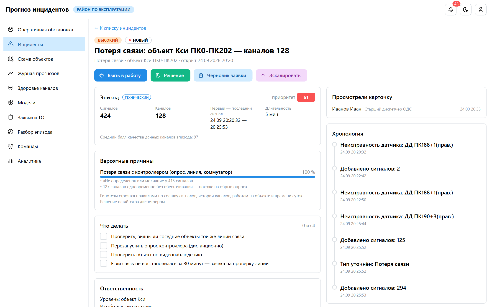

## 2. Индикатор пожарного риска

«Кси ПК202–ПК302», 29.06.2026, 10:55–11:20: срабатывания дымовых извещателей.

- Карточка «Пожар / задымление»: критический уровень, приоритет до 100, 28 каналов. Это сработка
  индикатора по правилам, а не прогноз пожара: подтверждённых пожаров в данных нет.
- Гипотезы: «возгорание или задымление» (65 %, подтверждают несколько независимых каналов) против
  «ложного срабатывания» (35 %, у части извещателей история сбоев).
- Если за 5 минут карточку никто не взял, она эскалируется в ОДС.
- Решение: «что произошло» → реальное событие или ложное срабатывание, причина из справочника,
  черновик заявки.

## 3. Отказ датчика, предсказанный заранее

«АНС2 Н1 ПК100 Обр» на «ДУ объект Альфа».

1. **До запуска.** «Журнал прогнозов» → «Бэктест». Прогноз от 01.06.2026 23:59 — критический уровень,
   72 %. Факторы: 65 суток с неисправностями из последних 90, свежая неисправность накануне.
2. **Запуск.** Канал уходит в «Отключено устройство» 02.06 в 21:00 — через 21 час после прогноза.
   Открывается карточка технического контура с гипотезой «отказ отдельного датчика».
3. **Решение.** «Что произошло: неисправность датчика» — это подтверждающая метка для дообучения.
4. **Заявка.** Черновик → утверждение → передача в систему учёта заявок → бригада, отчёт.

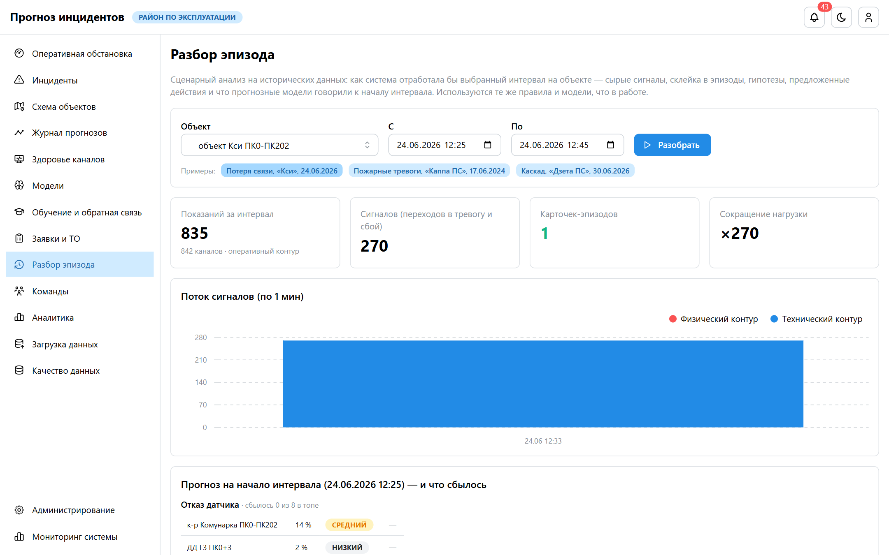

## 4. Учебный контур: пожар на полигоне

```bash
docker compose --profile training up -d --build
```

1. https://localhost/training/ (или переключатель «Учебный контур» в шапке), вход `disp.petrov`. «Учебные задания» → «Пожар: от сигнала до решения».
2. Урок приводит объект Мю полигона в исходное состояние и просит симулятор запустить сценарий
   `fire`. Через 15–20 секунд в очереди появляется карточка пожара (сработка индикатора).
3. Панель задания ведёт по шагам: открыть, взять в работу, решить («Выезд бригады», «Реальное
   событие»), составить черновик заявки. «Показать где» подсвечивает нужную кнопку.
4. Если выбрать неверную причину, панель объяснит, почему здесь правильно другое. Итог — время,
   ошибки, подсказки.

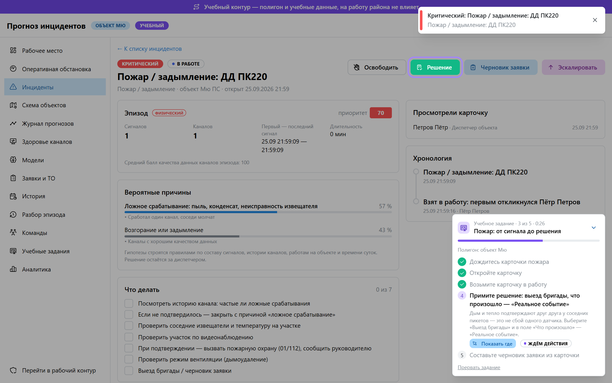

## 5. «Кто первый»

1. В учебном контуре симулятор запускает любой сценарий на объекте Кси (меню «Симулятор датчиков», /simulator/).
2. `ods.ivanov` и `disp.nikolaev` открывают карточку и одновременно нажимают «Принять».
3. Первый получает карточку, второй — «Карточку уже взял … — откликнулся первым». В карточке видно,
   кто первым заметил и кто первым откликнулся.
4. В рабочем контуре «Аналитика» → «Сотрудники и команды» — рейтинг по эмуляции смен 16–30 июня 2026.

## 6. История

«История» → «объект Мю» → «Месяц»: каналы по суткам за май 2024 года из архива. Щелчок по «ГАЗ Д25
ПК402+8» открывает показания 07.05.2024 с порогами, сменами состояния и нештатными сутками.
