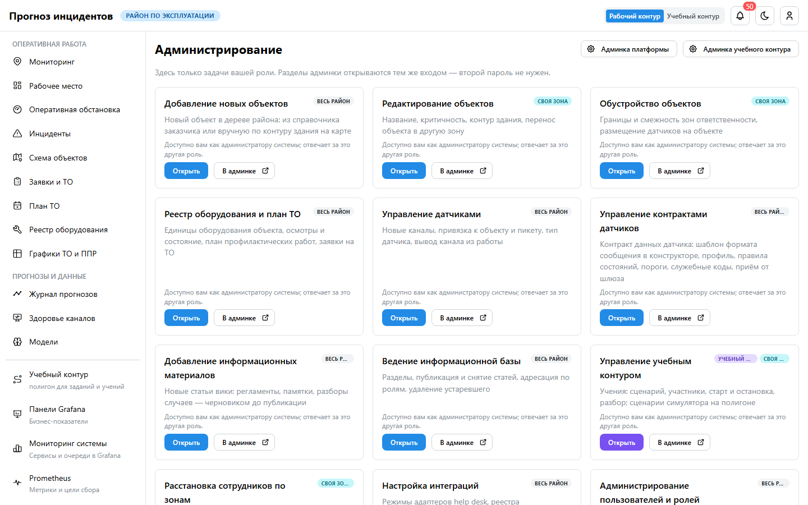
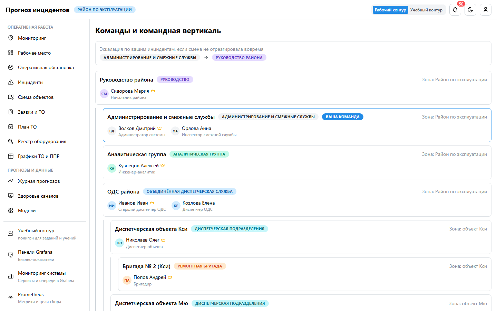
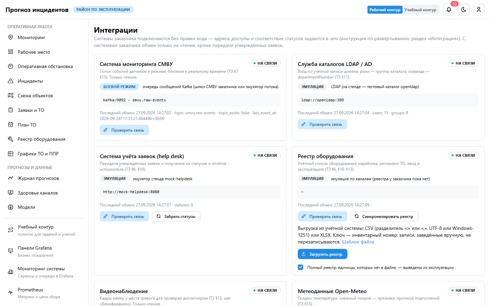

# Руководство пользователя: администратор

**Для кого.** Администраторы системы. Вы отвечаете за пользователей и роли, интеграции с системами
заказчика, справочники и настройки, следите за работой сервисов. Остальные административные
операции закреплены за ролями (матрица ответственности), но доступны и вам как владельцу системы.

## 1. Раздел «Мои задачи»

Карточки операций с пределами («весь район», «своя зона»), кнопками «Открыть» (страница интерфейса)
и «В админке». Админка платформы и админка учебного контура открываются тем же входом — второй пароль
не нужен.

## 2. Пользователи и роли

- **Роли** (8): диспетчер ОДС, диспетчер подразделения, руководитель подразделения, аналитик,
  инженер ТО, ремонтная бригада, наблюдатель, администратор.
- В эксплуатации роли приходят из **AD**: группа каталога = роль, `departmentNumber` = код команды
  (зона ответственности). Вручную — админка → «Пользователи и роли».
- **Команды** (раздел «Команды»): вертикаль «бригада → диспетчерская объекта → ОДС → руководство»,
  зона команды становится зоной её участников.
- Блокировка после 5 неудачных входов на 15 минут; снять раньше — `manage.py unlock <логин>`.

## 3. Интеграции

Раздел **«Интеграции»** — карточка на каждую внешнюю систему: режим («эмуляция» или «боевой
режим»), адрес, последний успешный обмен и последняя ошибка.

| Система | Проверка | Ручная синхронизация |
|---|---|---|
| СМВУ (Kafka) | тема и последнее событие | — |
| LDAP / AD | привязка, число учёток и групп | — |
| Система учёта заявок | запрос статусов | «Забрать статусы» |
| Реестр оборудования | число единиц по источникам | «Синхронизировать реестр», загрузка CSV/XLSX |
| Видеонаблюдение | связь, число камер | — |
| Метеоданные | запрос на сегодня | «Загрузить последние сутки» |
| Prometheus и Grafana | состояние | — |

Подключение систем заказчика — переменные `.env` (`HELPDESK_*`, `REGISTRY_*`, `VMS_*`, `LDAP_*`),
порядок — в инструкции по развёртыванию.

## 4. Мониторинг системы

Пункты меню внизу:
- **«Панели Grafana»** — бизнес-показатели;
- **«Мониторинг системы»** — сервисы, очереди, база в Grafana (роль Admin);
- **«Prometheus»** — метрики и цели сбора.

Вход — вашей учётной записью, без отдельных паролей. Аналитик видит только бизнес-панели.

## 5. Справочники и настройки

| Что | Где |
|---|---|
| Политики эскалации (время реакции по уровням) | админка → «Политики эскалации» |
| Причины решений | админка → «Причины решений» |
| Профили датчиков, шаблоны форматов | «Конструктор датчиков» (ведёт аналитик) |
| Камеры видеонаблюдения | админка → «Камеры видеонаблюдения» |
| Регламент ТО | «Графики ТО и ППР» → «Регламент ТО» (ведёт инженер ТО) |
| Периодические задачи (прогноз, переобучение, погода, реестр) | админка → «Periodic tasks» |
| Вики | админка → «Информационная база» |

## 6. Эксплуатация

- Резервные копии — ежедневно, 7 дневных, 4 недельных, 3 месячных; восстановление — по инструкции.
- Журнал действий пользователей — админка → «Журнал действий».
- Перед вводом в эксплуатацию — чек-лист из отчёта по безопасности: свой `SECRET_KEY`,
  `DEMO_USERS=false`, смена паролей, сертификат, LDAPS, доступ только из сети предприятия.

## 7. Пользователи: кто и как заводит

- Учётные записи и роли ведёте **вы**. В эксплуатации пользователь создаётся сам при первом входе
  через AD: группа — роль, `departmentNumber` — команда и зона. Вручную — админка → «Пользователи и
  роли» → «Добавить», затем роль (группа) и команда.
- Руководитель подразделения пользователей не заводит: он закрепляет сотрудников за зонами и
  командирует их («Зоны и объекты» → «Сотрудники»).
- Отключить сотрудника — снять флаг «Активен» (или заблокировать в AD): вход и доступ к панелям
  пропадают в течение 30 секунд.

## 8. Режимы системы

- **Учебный контур и симулятор** работают всегда, вместе с платформой (`/training/`, `/simulator/`):
  своя база, тема Kafka и help desk.
- **Система заявок**: `HELPDESK_MODE` — `mock` (эмулятор), `rest` (help desk заказчика) или `off`
  (без внешней системы — бригада берёт утверждённую заявку в работу сама).
- **Оповещения о работе платформы** — правила Prometheus: сервис недоступен, задержка потока выше
  300 с, неизвестные каналы в потоке, ошибки и медленные ответы API, сбои фоновых задач, подключения к
  базе. Видны на панели «Оповещения» в «Мониторинге системы» и на странице «Alerts» Prometheus.
