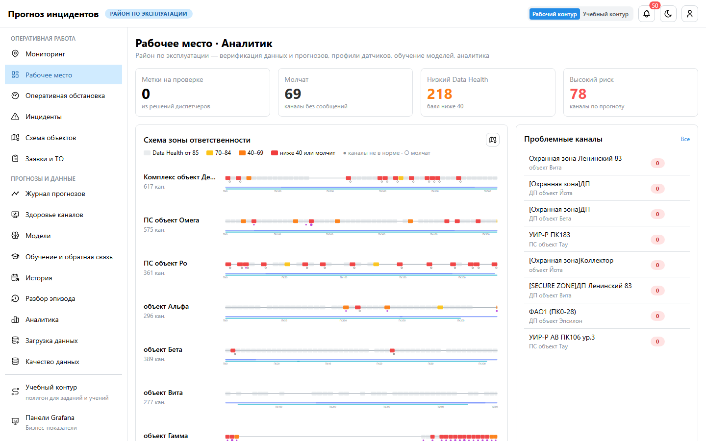
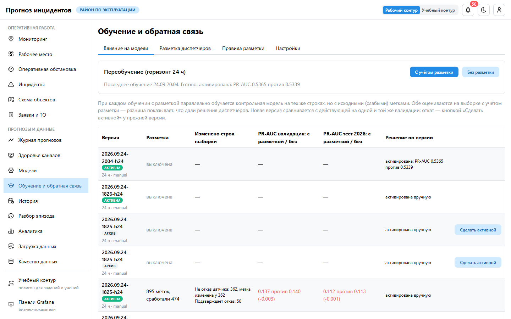
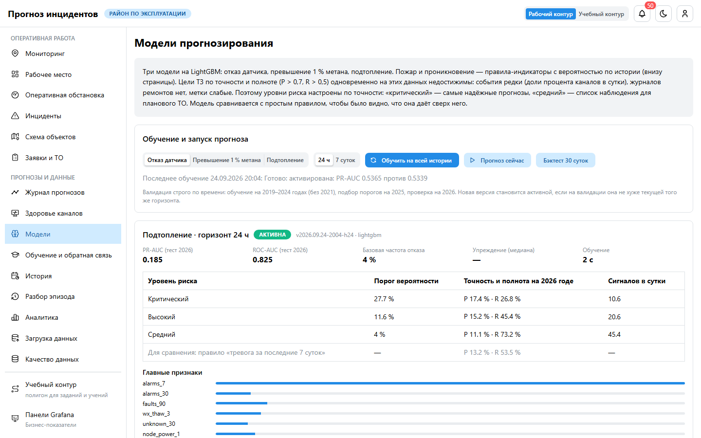
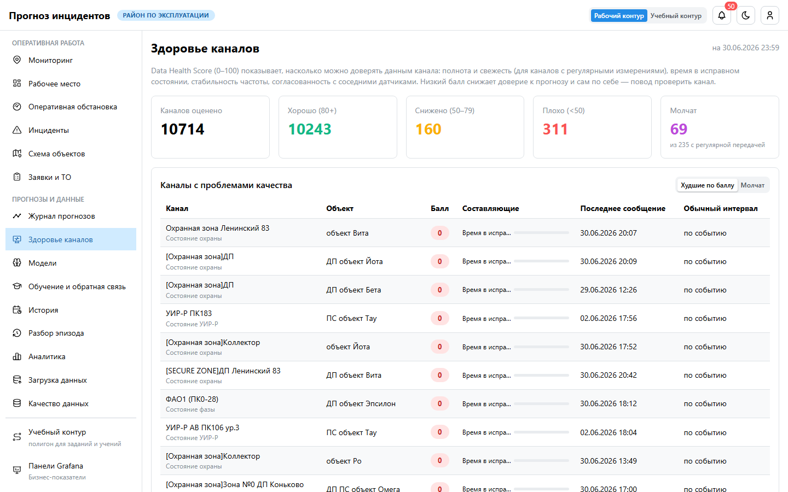
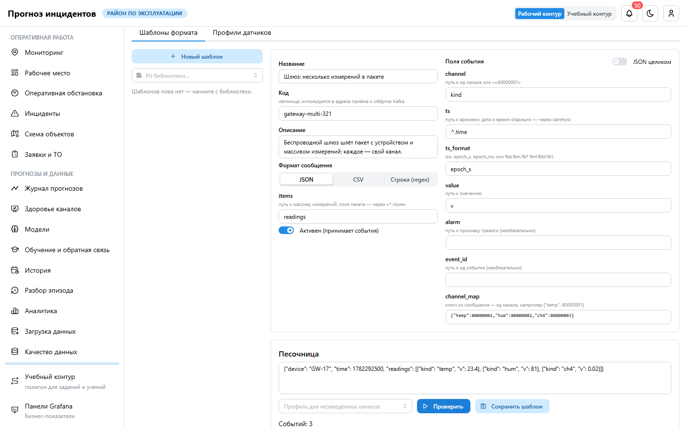

# Руководство пользователя: аналитик

**Для кого.** Инженеры-аналитики. В сценариях ТЗ §12 вы «ответственный за верификацию данных»:
проверяете метки из решений диспетчеров, следите за качеством данных, ведёте модели и калибровку,
подключаете новые датчики и форматы, заводите объекты и каналы.

## 1. Рабочее место

«Метки на проверке», «Молчат», «Низкий Data Health», «Высокий риск», список проблемных каналов.
Карта мониторинга по умолчанию — в режиме «Данные».

## 2. Метки обучения

«Обучение и обратная связь» → очередь меток. Каждое решение диспетчера с ответом «что произошло»
превращается в метку по правилам «причина → эффект».

1. **Принять** — решение подтверждает событие (например, отказ канала).
2. **Отклонить** — метка ошибочна; отменить можно и позже.
3. Правила «причина → эффект» и порог деградации — там же.

Влияние меток видно в каждой версии модели: её сравнивают с контрольной моделью без разметки.

## 3. Модели и калибровка

Раздел «Модели»:

- три модели LightGBM: отказ датчика, превышение 1 % метана, подтопление; версии, метрики на
  отложенном 2026 годе, уровни риска с точностью и полнотой;
- **обучение и запуск прогноза**, бэктест; плановое переобучение раз в неделю (чемпион / претендент),
  откат версии;
- внизу — **калибровка индикаторов пожара и НСД**: по интервалам индекса — число случаев в архиве,
  вероятность и проверка на 2026 годе («прогноз → факт»). Кнопка «Пересчитать по архиву».

## 4. Качество данных

| Раздел | Что смотреть |
|---|---|
| Здоровье каналов | Data Health: полнота, свежесть, стабильность, согласованность; молчащие каналы |
| Качество данных | отчёты загрузки: корректные измерения, служебные коды, артефакты времени, неизвестные каналы |
| Загрузка данных | справочники и журналы из каталога данных или файлом |
| История | матрица «каналы × сутки» объекта и ряд канала за любой период |

## 5. Конструктор датчиков

Новый датчик или шлюз со своим форматом подключается без программиста.

1. **Шаблоны формата** → «Из библиотеки» (СМВУ JSON и CSV, шлюз с несколькими измерениями,
   текстовая строка, MQTT) или «Новый шаблон».
2. Задайте формат (JSON, CSV, строка по регулярному выражению) и поля: канал (путь или константа,
   `channel_map` для нескольких измерений), время и его формат, значение, тревога.
3. Вставьте пример сообщения в **песочницу** и нажмите «Проверить»: увидите события, ошибки и то,
   как профиль канала нормализует значение (состояние, число, качество).
4. **Сохраните шаблон** — получите адрес приёма и ключ. Шлюз отправляет сообщения по HTTP с ключом
   или пишет в Kafka обёртку `{"template": "<код>", "payload": "…"}`.
5. Заведите каналы с ид из сообщений в «Зоны и объекты» → «Датчики».
6. **Профили датчиков**: диапазон, дрейф нуля, пороги и направление, служебные коды, ожидаемый
   интервал, правила «текст → состояние» и проверка значения.

## 6. Объекты и датчики

«Зоны и объекты»: новый объект по контуру здания на карте или из справочника; новые каналы
(ид от 80 000 001), привязка к объекту и пикету, тип датчика.

## 7. Панели Grafana

Пункт меню **«Панели Grafana»** — бизнес-показатели (инциденты, реакция диспетчеров, качество
прогнозов), только просмотр. Вход — вашей учётной записью, без отдельного пароля.

## 8. Модели после развёртывания

Модели поставляются обученными на журналах заказчика 2019–2026 и активны сразу. Переобучение требует
истории за несколько лет: без неё запуск завершится с причиной «Недостаточно истории для обучения», а
активная модель останется прежней. Загрузите журналы («Загрузка данных») и запустите обучение снова.

## 9. Режимы работы

| Режим | Как включить | Для чего |
|---|---|---|
| Режимы карты | кнопки над картой «Мониторинг» | «Данные» по умолчанию; «Прогноз» — риск по каналам, «Датчики» — состояние |
| Спутник и этажи | кнопка со спутником; переключатель этажей справа | снимок местности, план этажа, прозрачность плана |
| Учебный контур | переключатель в шапке | полигон Мю, Кси, Тау: задание «Метка из решения диспетчера», участие в учениях; на работу района не влияет |
| Телефон | адрес в браузере → «Добавить на главный экран» | просмотр обстановки |

## 10. Чего роль не делает

Не принимает решений по карточкам вместо диспетчера (только метки и разметка), не утверждает заявки,
не настраивает интеграции с системами заказчика (это администратор).
