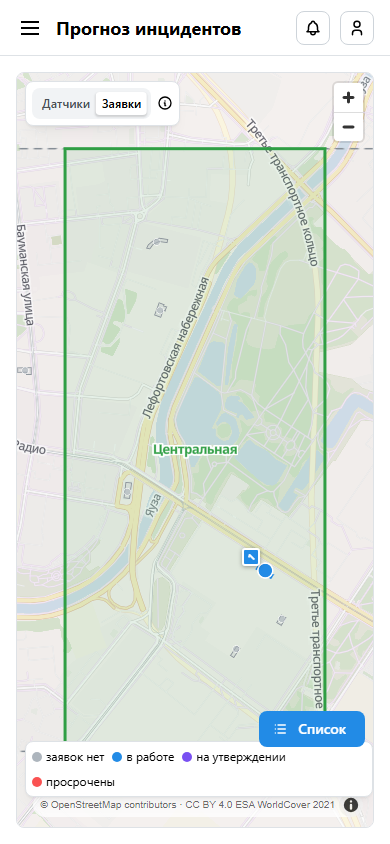
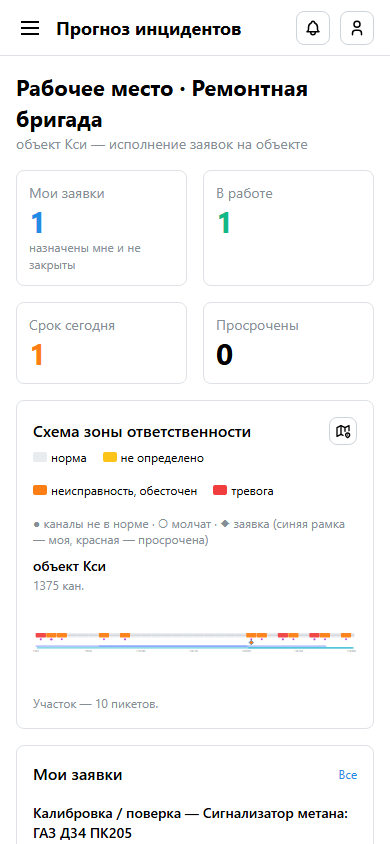
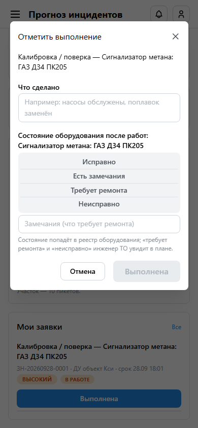
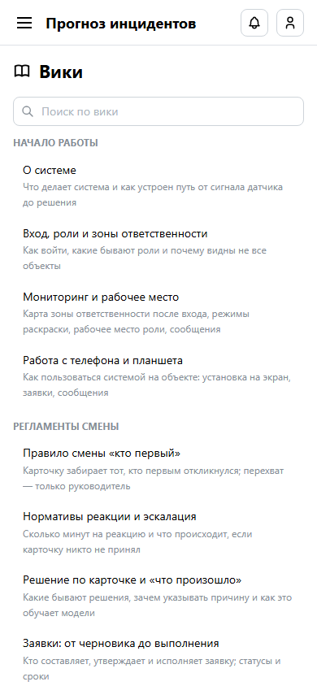

# Руководство пользователя: ремонтная бригада

**Для кого.** Бригадиры и исполнители ремонтных бригад. Вы видите только свои заявки и работаете
с телефона на объекте.

## 1. Установка на телефон

1. Откройте адрес системы в браузере телефона (Chrome, Safari, Яндекс Браузер) и войдите.
2. Меню браузера → **«Добавить на главный экран»** (в Safari — «Поделиться» → «На экран Домой»).
3. Система откроется как приложение — без адресной строки, со своим значком.

## 2. Где ваши заявки

- **Мониторинг** — карта в режиме «Заявки»: ромб на здании — ваша заявка. Касание здания открывает
  его заявки с кнопками действий. Кнопка «Список» внизу — объекты и выбранный объект.
- **Рабочее место** — счётчики «Мои заявки», «В работе», «Срок сегодня», «Просрочены», схема трассы
  и список «Мои заявки».

## 3. Порядок работы по заявке

1. Пришло сообщение о новой заявке (колокольчик) — откройте её.
2. На объекте нажмите **«Взять в работу»**.
3. После работ — **«Выполнена»**:
   - **что сделано** — коротко: что проверено, что заменено;
   - **состояние оборудования** после работ: исправно / есть замечания / требует ремонта /
     неисправно;
   - **замечания** — что требует ремонта.
4. Отчёт попадёт в заявку и в карточку инцидента — диспетчер увидит результат. Состояние
   оборудования попадёт в реестр: «требует ремонта» инженер ТО поставит в план.

## 4. Советы

- Кнопки заявок крупные, нажимаются одной рукой.
- При слабой связи страница обновится сама, когда сеть вернётся. Действие, отправленное без сети,
  нужно повторить.
- Прогнозы бригаде не показываются — только состояние каналов на объекте.
- Регламенты и памятки — «Вики» (меню ☰).

## 5. Чего роль не делает

Не видит чужие заявки и карточки инцидентов, не создаёт заявки (их составляют диспетчер или
инженер ТО и утверждает руководитель).
