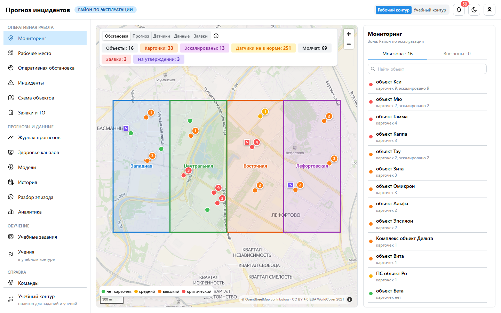
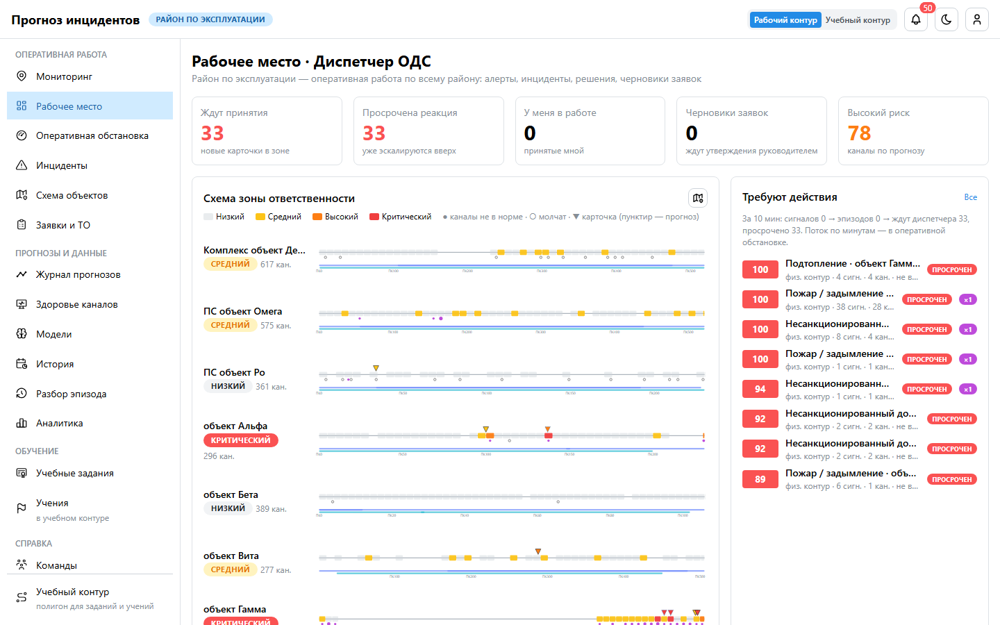
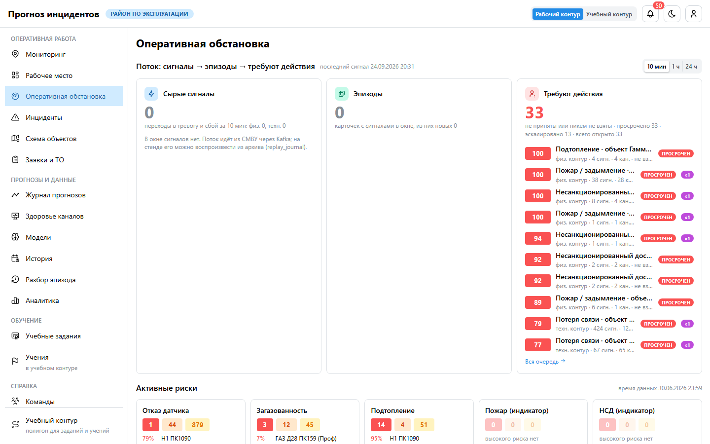

# Руководство пользователя: диспетчер ОДС

**Для кого.** Диспетчеры объединённой диспетчерской службы района. Вы видите карточки всех объектов
района и отвечаете за реакцию на них в смену.

**Главное правило.** Система не принимает решений за вас (ТЗ §5). Она собирает сигналы в эпизоды,
показывает вероятные причины и следующее действие, но решение фиксируете вы. Ваше решение и ответ
«что произошло» становятся обратной связью для моделей.

## 1. Вход и начало смены

1. Откройте адрес системы в Chrome или Яндекс Браузере и войдите учётной записью домена.
2. Откроется **«Мониторинг»** — карта района: объекты в цвете самой серьёзной открытой карточки,
   круг с числом — открытые карточки объекта, ромб — заявки.
3. Второй пункт меню — **«Рабочее место»**: счётчики «Ждут принятия», «Просрочена реакция»,
   «У меня в работе», очередь «Требуют действия», схема по пикетам, «Мои показатели».
4. Колокольчик в шапке — сообщения: новые карточки, эскалации, заявки, учения. Проверьте, что пришло
   до вашей смены.

## 2. Что где

| Задача | Раздел |
|---|---|
| Обстановка на карте | Мониторинг |
| Очередь карточек, свои показатели | Рабочее место |
| Поток «сигналы → эпизоды → требуют действия», риски по пяти задачам | Оперативная обстановка |
| Все карточки с фильтрами | Инциденты |
| Схема трассы по пикетам | Схема объектов |
| Прогнозы с вероятностью, горизонтом и причинами | Журнал прогнозов |
| Черновики заявок и их статусы | Заявки и ТО |
| Показания канала или объекта за любой период | История |
| Разбор прошлого эпизода | Разбор эпизода |
| Регламенты, памятки | Вики |

## 3. Карточка: от сигнала до решения

1. **Откройте** карточку из очереди «Требуют действия». Очередь отсортирована по операционному
   приоритету (вероятность × тяжесть × критичность объекта × срочность × уверенность данных), а не по
   времени: сверху — самое опасное.
2. **Примите** карточку («Принять» или «Взять в работу»). Действует правило «кто первый»: карточку
   забирает тот, кто первым откликнулся. Если коллега успел раньше, вы увидите его имя, кнопки станут
   неактивны. Любое первое действие (шаг чек-листа, решение, черновик заявки) тоже закрепляет карточку.
3. **Изучите эпизод:** сколько сигналов и каналов склеено, первое и последнее событие, гипотезы
   причины с весами (например, «потеря связи с контроллером» при каскаде по одному шкафу).
4. **Проверьте** по чек-листу «Что делать». Сомневаетесь, сбой это или событие, — откройте историю
   канала. Для пожара и проникновения используйте блок **«Проверка по камерам»**: ближайшие к месту
   тревоги камеры, кадр на момент тревоги и текущий кадр. Просмотр записывается в хронологию карточки.
5. **Примите решение** кнопкой «Решение»:
   - «Что произошло на самом деле» — главная обратная связь для моделей: неисправность датчика,
     потеря связи, обесточивание, ложное срабатывание, внешнее воздействие, работы на объекте,
     реальное событие, недостаточно данных;
   - решение: выезд бригады, направлена проверка, мониторинг ситуации, ложное срабатывание,
     инцидент подтверждён, устранено;
   - причина из справочника и комментарий;
   - для прогнозной карточки — «помог ли прогноз».
6. Нужна работа на месте — **«Черновик заявки»**: объект, вид работ, приоритет и срок заполнятся сами.
   Черновик уходит руководителю на утверждение.

> Не закрывайте физическую угрозу (пожар, газ, вода, проникновение, аномальная температура) как ложную без проверки:
> повтор угрозы на объекте в течение 6 часов снижает показатель качества решений.

## 4. Нормативы реакции и эскалация

| Уровень | Реакция до |
|---|---|
| Критический | 5 минут |
| Высокий | 15 минут |
| Средний | 60 минут |
| Низкий | 4 часа |

Если карточку никто не принял в срок, она эскалируется: ответственность поднимается на уровень выше
(часть объекта → объект → район), уведомление получает руководство. Эскалация останавливается,
как только карточку приняли. Не успеваете — **«Освободить»**, чтобы карточку взял коллега.

## 5. Прогнозы

- **Журнал прогнозов**: задача, канал, объект, вероятность за 24 часа, уровень, исход.
- Отказ датчика, загазованность, подтопление — модели; пожар и НСД — индикаторы по правилам.
  Для них показана вероятность, что угроза проявится за сутки, по истории похожих случаев.
- Карточка прогноза: факторы («почему так»), насколько доверять уровню, качество данных канала,
  история канала за 30 суток, связанные карточки, что делать.
- От уровня «высокий» прогноз создаёт прогнозную карточку в очереди.

## 6. Конец смены

1. Проверьте «У меня в работе»: незавершённые карточки освободите или передайте устно.
2. «Мои показатели» на рабочем месте: сколько раз откликнулись первым, скорость отклика, качество
   решений за 30 суток.

## 7. Заявка после решения и закрытие карточки

1. **Черновик** — в карточке «Черновик заявки»: объект, вид работ, приоритет и срок подставятся сами
   (критический — 2 часа, высокий — 8, средний — сутки, низкий — 3 дня). Черновик виден в «Заявки и ТО».
2. **Утверждение** делает руководитель; исполнитель подставится сам — бригадир бригады зоны объекта.
3. **Передача в систему заявок** заказчика — кнопка «Передать в систему заявок» в «Заявки и ТО»
   (руководитель или вы). Если системы заявок нет, этого шага нет: бригада берёт заявку сразу.
4. **Ход работ** виден в хронологии карточки: «передана в систему заявок», «бригада приступила»,
   «выполнена» с отчётом бригады.
5. **Закрытие карточки.** Получив отчёт, примите решение **«Устранено»** — карточка перейдёт в «Решён».
   Ложную тревогу закрывает решение «Ложное срабатывание». Решения «Выезд бригады», «Направлена
   проверка», «Инцидент подтверждён» оставляют карточку «В работе», «Мониторинг ситуации» — «Принят».
6. Заявку можно **отменить** до выполнения («Заявки и ТО» → «Отменить»), например если причина
   устранена дистанционно.

## 8. Режимы работы

| Режим | Как включить | Для чего |
|---|---|---|
| Карта «Обстановка» | «Мониторинг», по умолчанию | цвет объекта — самая серьёзная открытая карточка |
| Карта «Прогноз», «Датчики», «Данные», «Заявки» | кнопки над картой | риск по прогнозу, датчики не в норме, качество данных, открытые заявки |
| Спутник и этажи | кнопка со спутником; переключатель этажей справа | снимок местности, план этажа с датчиками этажа, прозрачность плана ползунком |
| Схема по пикетам | «Схема объектов», блок на рабочем месте | трасса коллектора: где сработали датчики |
| История | «История» | показания канала или объекта за любой период с 2019 года |
| Разбор эпизода | «Разбор эпизода» | воспроизвести прошлый эпизод по шагам |
| Учебный контур | переключатель в шапке | полигон Мю, Кси, Тау: учебные задания и учения, на работу района не влияет |
| Учебные задания | «Учебные задания» | «Пожар: от сигнала до решения», «Неисправный датчик — не событие», «Проникновение на объект под охраной» |
| Телефон | адрес в браузере → «Добавить на главный экран» | то же, что на компьютере; меню — кнопка ☰ |

## 9. Чего роль не делает

- Не утверждает заявки и не перехватывает чужие карточки — это руководитель.
- Не меняет модели, правила разметки и профили датчиков — это аналитик.
- Не планирует ТО — это инженер ТО.

## 10. Вопросы

- **Объекта не видно.** ОДС видит весь район; если нет объекта — он не заведён в справочнике,
  обратитесь к аналитику.
- **Кнопки неактивны.** Карточку уже взял коллега — его имя написано в карточке.
- **Отработать без риска:** «Учебные задания» и учебный контур (переключатель в шапке).
