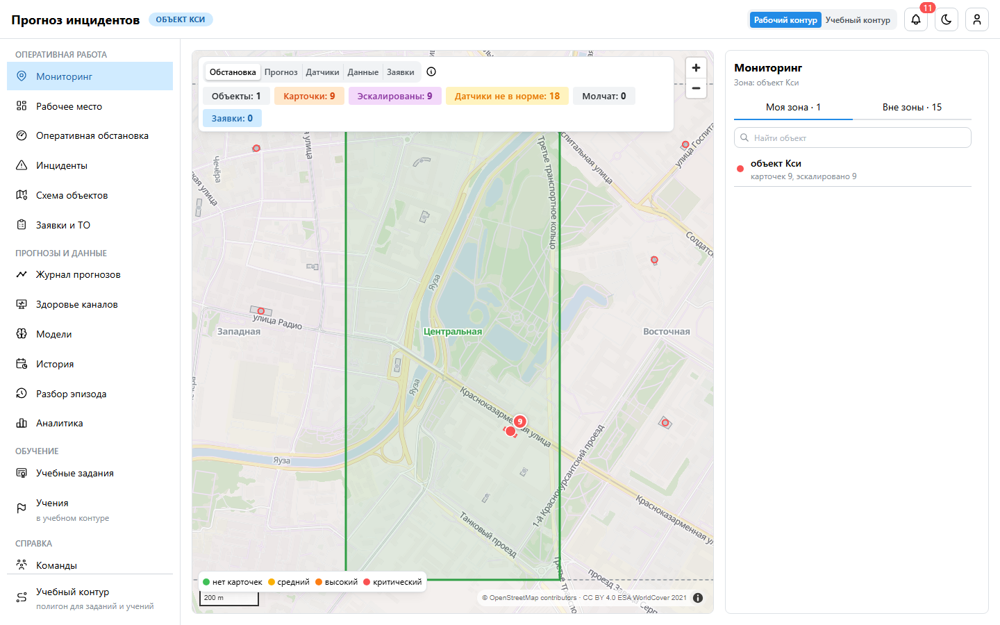
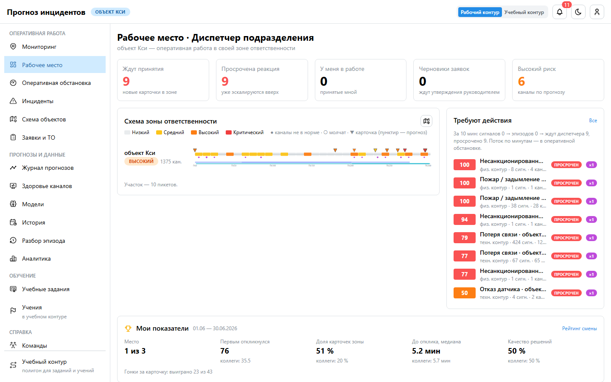
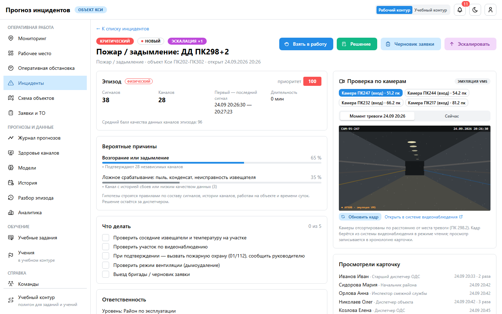
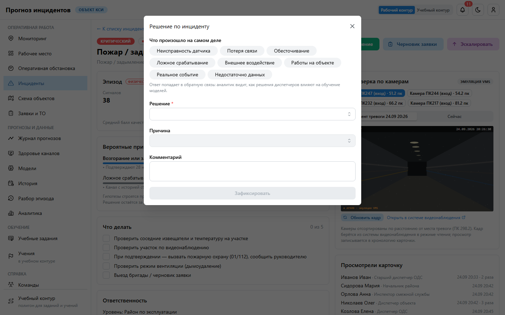
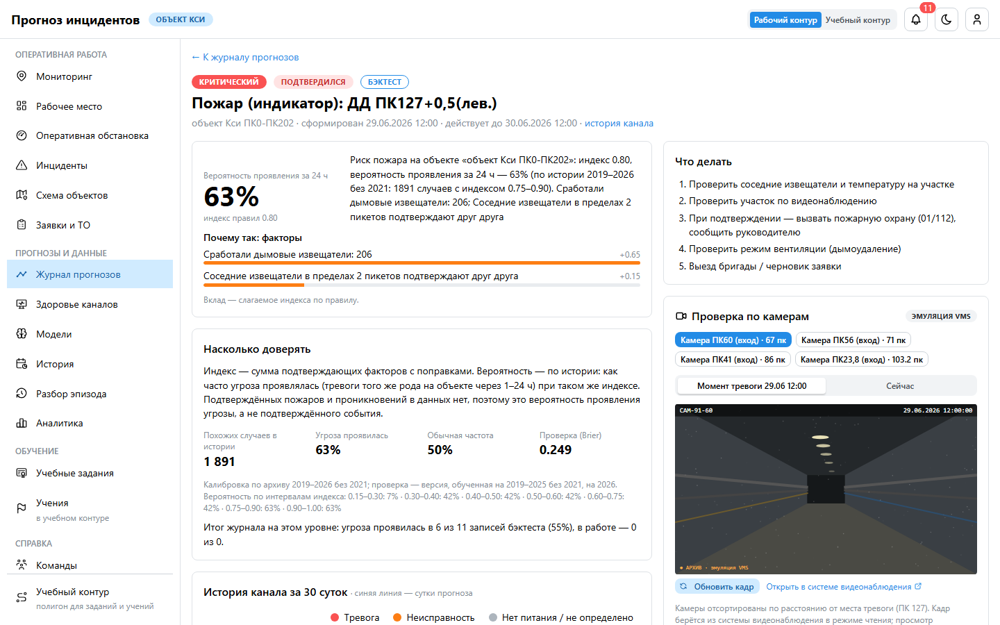

# Руководство пользователя: диспетчер подразделения

**Для кого.** Диспетчеры эксплуатационных подразделений (диспетчерских объектов). Вы работаете так же,
как диспетчер ОДС, но в своей **зоне ответственности**: видите карточки, прогнозы и заявки только
своих объектов и первыми получаете карточки своего объекта.

## 1. Вход и зона ответственности

1. Войдите учётной записью домена. Откроется **«Мониторинг»**: ваша зона выделена цветом и толстой
   границей, смежные зоны — пунктиром, остальное — серым.
2. Объекты вне зоны показаны контуром без подробностей: ими занимается их зона. Красная обводка
   у смежной зоны — там есть открытые карточки.
3. Если нужного объекта не видно — зона назначена неверно, обратитесь к руководителю.

## 2. Рабочее место

Счётчики «Ждут принятия», «Просрочена реакция», «У меня в работе», «Черновики заявок», «Высокий риск»;
очередь «Требуют действия» по операционному приоритету; схема по пикетам; «Мои показатели».

## 3. Карточка инцидента

Порядок работы с карточкой:
1. открыть из очереди или со схемы;
2. принять (правило «кто первый»);
3. гипотезы причины и чек-лист;
4. проверка;
5. решение с ответом «что произошло»;
6. черновик заявки.

### Проверка по камерам

Шаг 4 сценария ТЗ §12 — верификация. В карточке блок **«Проверка по камерам»**:

- камеры отсортированы по расстоянию в пикетах от датчика, который сработал;
- «Момент тревоги» — кадр из архива системы видеонаблюдения на время тревоги, «Сейчас» — текущий;
- «Открыть в системе видеонаблюдения» — поток или архив камеры в новой вкладке;
- просмотр записывается в хронологию: руководитель видит, что проверка была.

Пример: один дымовой извещатель без роста температуры, на кадре — люди в спецодежде. Это работы:
решение «Ложное срабатывание», что произошло — «Работы на объекте».

### Решение

| Решение | Когда |
|---|---|
| Выезд бригады | нужна работа на месте: реальная угроза, отказ оборудования |
| Направлена проверка | проверить по камерам или обходчиком |
| Мониторинг ситуации | ждать развития: рост показаний, ожидаются осадки |
| Ложное срабатывание | подтверждено, что угрозы нет |
| Инцидент подтверждён | событие реально произошло |
| Устранено | дистанционно (перезапуск, переключение) или на месте |

Поле «что произошло» обучает модели: например, «неисправность датчика» становится примером отказа
канала после проверки аналитиком.

## 4. Прогноз пожара и НСД

Карточка прогноза пожара показывает **вероятность проявления угрозы за 24 часа** — долю похожих
случаев в истории, в которых тревоги извещателей повторились, — и индекс правил. В блоке «Насколько
доверять» видно, сколько было похожих случаев. Для НСД вероятность повтора высокая почти всегда
(двери и люки открываются при работах), поэтому главное — проверка по камерам и наряд-допуску.

## 5. Нормативы и эскалация

Критический — 5 минут на реакцию, высокий — 15, средний — 60, низкий — 4 часа. Без реакции карточка
уходит на уровень выше (объект → район) и видна руководителю как эскалированная.

## 6. Чего роль не делает

Не видит чужие зоны (кроме командирования руководителем), не утверждает заявки, не перехватывает
карточки коллег, не меняет модели и профили.

## 7. Вопросы

- **Меня командировали в другую зону.** До конца срока вы видите карточки этой зоны и получаете её
  уведомления; своя зона остаётся.
- **Карточка каскада на весь объект.** Это одна карточка: решайте причину (питание, связь), а не
  каждый датчик.
