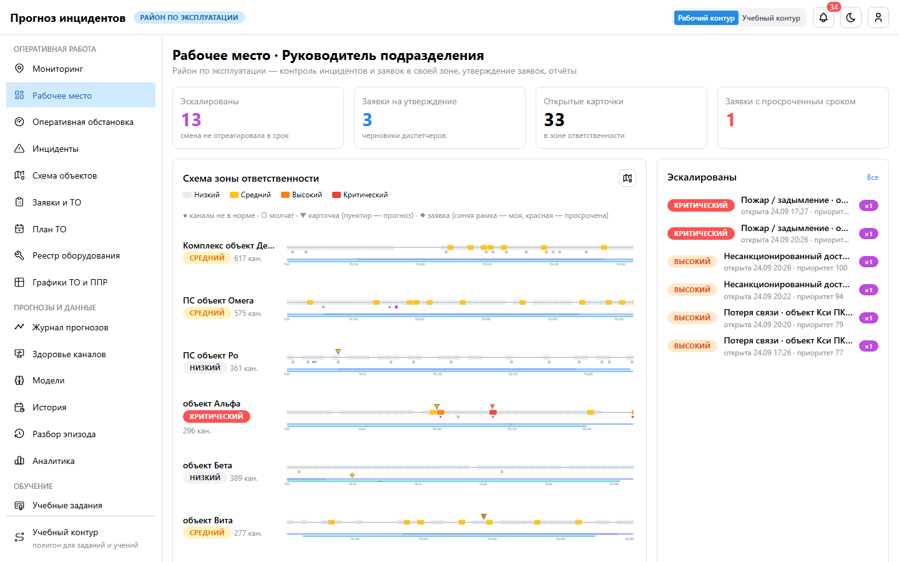
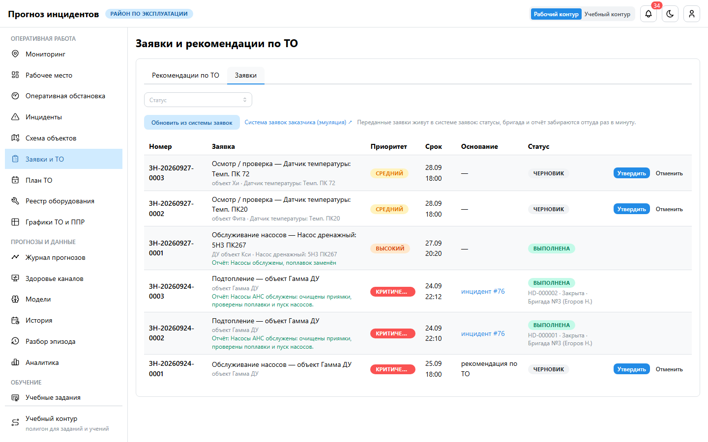
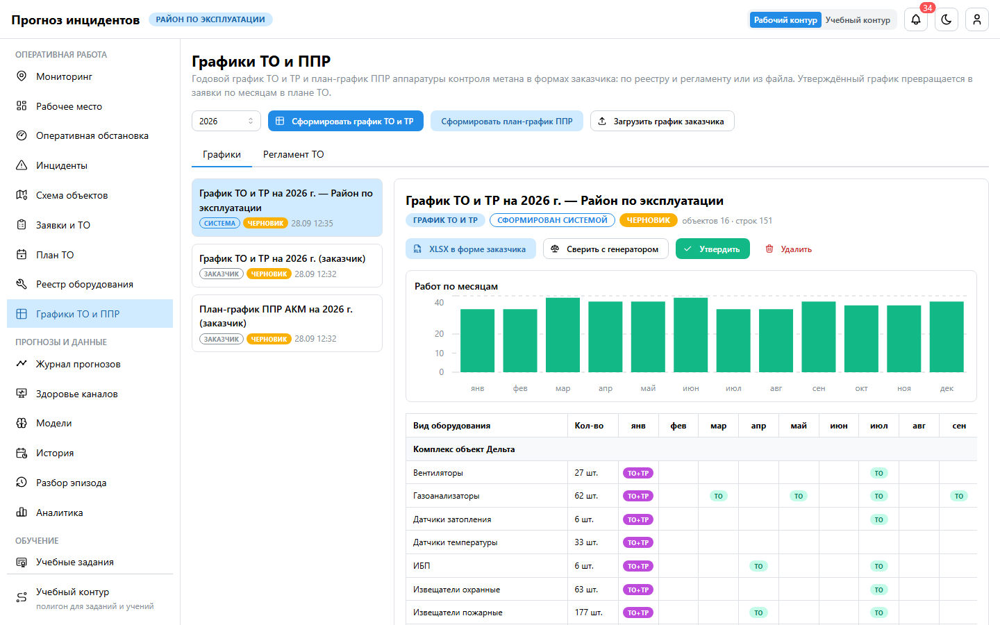
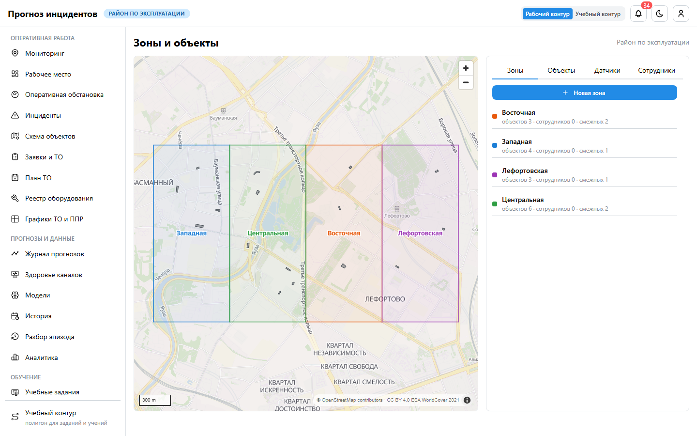
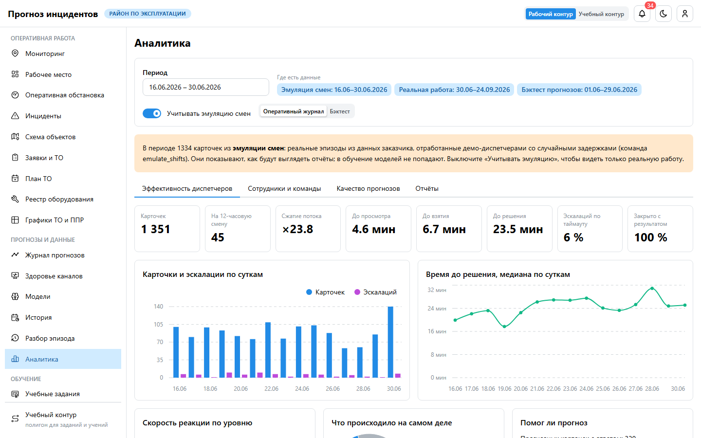

# Руководство пользователя: руководитель подразделения

**Для кого.** Начальники районов и эксплуатационных подразделений. Вы контролируете реакцию смены
в своей зоне, утверждаете заявки и графики ТО, отвечаете за структуру зоны и людей, проводите учения
и смотрите отчёты.

## 1. Рабочее место

После входа — «Мониторинг» своей зоны, второй пункт — «Рабочее место»:

- **Эскалированы** — карточки, на которые смена не отреагировала в норматив;
- **Заявки на утверждение** — черновики диспетчеров и инженера ТО;
- **Открытые карточки**, **Заявки с просроченным сроком**.

## 2. Эскалации и перехват

1. Откройте эскалированную карточку.
2. Назначьте ответственного устно или нажмите **«Перехватить»**: карточка перейдёт к вам.
   Перехват пишется в хронологию и учитывается в показателях сотрудника.
3. Можно действовать по чужой карточке, не забирая её: отметить шаг чек-листа, посмотреть камеры.

## 3. Заявки

«Заявки и ТО» → «Заявки»:
1. **Утвердить** черновик. Исполнитель подставится сам — бригадир бригады зоны объекта.
2. **Передать в систему заявок** (help desk заказчика). Дальше статусы, бригада и отчёт приходят
   оттуда раз в минуту.
3. **Отменить** можно на любом шаге до выполнения.

## 4. План ТО и графики

- **«План ТО»** — что просрочено по регламенту, что рекомендует система, что запланировано.
- **«Графики ТО и ППР»** — годовой график ТО и ТР и план-график ППР метановых датчиков в формах
  заказчика. Инженер ТО формирует или загружает график, вы **утверждаете**. После утверждения работы
  текущего и следующего месяца появляются в плане ТО, инженер ставит их в план заявками.
- Сверка на странице графика показывает, как генератор системы распределил бы тот же состав
  оборудования: периодичность и нагрузку по месяцам.

## 5. Структура зоны и люди

Раздел **«Зоны и объекты»**:

| Вкладка | Что делаете |
|---|---|
| Зоны | обвести границу зоны на карте, подобрать смежные |
| Объекты | название, критичность, контур здания, перенос в другую зону |
| Сотрудники | назначить сотруднику зону; командировать в другую зону на срок (в несмежную — только крайний случай с причиной) |

## 6. Отчёты

«Аналитика»: эффективность диспетчеров (карточек на смену, время до принятия и решения, эскалации),
качество прогнозов, «Сотрудники и команды» (рейтинг «кто первый»). Выгрузка — PDF и XLSX за период.

## 7. Учения

В учебном контуре (переключатель в шапке) → «Учения»:
1. **Настроить:**
   - сценарий: пожар, газ, подтопление, проникновение, обесточивание, отказ датчика;
   - объект полигона, темп, осложнение через N минут;
   - участники, «молчащий» — для проверки эскалации.
2. **Запустить** по кнопке или таймеру. **Завершить** или прекратить досрочно с причиной.
3. **Разобрать:** проверки (карточка поднята, отклик в норматив, решение, заявка), вклад участников,
   хронология.

## 8. Вики

Вы добавляете статьи (черновиком) и ведёте информационную базу: разделы, публикация, адресация
по ролям.

## 9. Раздел «Мои задачи»

Сводка ваших административных операций с кнопками «Открыть» и «В админке»: редактирование
объектов, обустройство зоны, реестр и план ТО, вики, учебный контур, расстановка сотрудников.
Админка открывается тем же входом, второй пароль не нужен.

## 10. Заявки: полный цикл

| Статус | Ваше действие | Что происходит |
|---|---|---|
| Черновик | **«Утвердить»** | исполнитель — бригадир бригады зоны объекта (без бригады в зоне — пусто, назначьте в админке) |
| Утверждена | **«Передать в систему заявок»** | заявка получает номер в help desk заказчика; дальше статусы приходят оттуда раз в минуту |
| Передана | — | help desk: «Принята» → «Назначена бригада» → «В работе» |
| В работе | — | бригада на объекте |
| Выполнена | проверить отчёт | отчёт и состояние оборудования — в заявке, карточке и реестре |
| Любой до выполнения | **«Отменить»** | например, причина устранена дистанционно |

- **Без системы заявок** заказчика (режим без help desk) шага «Передать» нет: бригада берёт
  утверждённую заявку в работу сама.
- Карточку инцидента после выполнения закрывает диспетчер решением «Устранено»; при необходимости —
  вы, перехватив карточку.
- «Заявки с просроченным сроком» на рабочем месте — заявки, не выполненные к сроку.

## 11. Симулятор датчиков

Меню учебного контура → **«Симулятор датчиков»** (открывается тем же входом):
- **Готовые сценарии** — несколько событий на разных объектах полигона одной кнопкой: «Дневная смена:
  работы и шум», «Ночь: проникновение и возгорание», «Ливень: подтопление», «Авария питания района»,
  «Две аварии сразу», «Работы по наряду и утечка газа». У каждого — что должен сделать диспетчер.
  «Остановить все» отменяет и ещё не начавшиеся события;
- **Сценарий** на выбранном объекте: пожар, газ, подтопление, проникновение, аномальная температура,
  ППР, работы по наряду, обесточивание, отказ датчика, потеря связи;
- **каналы** объекта: режим, показание, дребезг, служебный код, каскад, охрана.

## 12. Режимы работы

| Режим | Как включить | Для чего |
|---|---|---|
| Режимы карты | кнопки над картой «Мониторинг» | «Обстановка», «Прогноз», «Датчики», «Данные», «Заявки» |
| Спутник и этажи | кнопка со спутником; переключатель этажей справа | снимок местности, план этажа, прозрачность плана |
| Учебный контур | переключатель в шапке | полигон Мю, Кси, Тау: учения, учебные задания, симулятор датчиков с готовыми сценариями; на работу района не влияет |
| Телефон | адрес в браузере → «Добавить на главный экран» | контроль смены с планшета или телефона |
