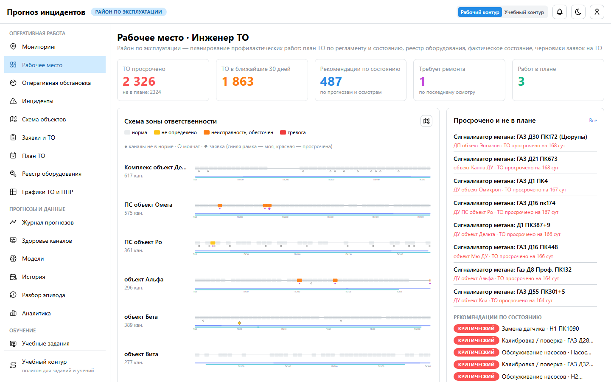
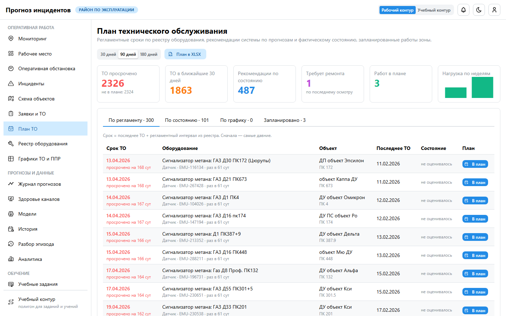
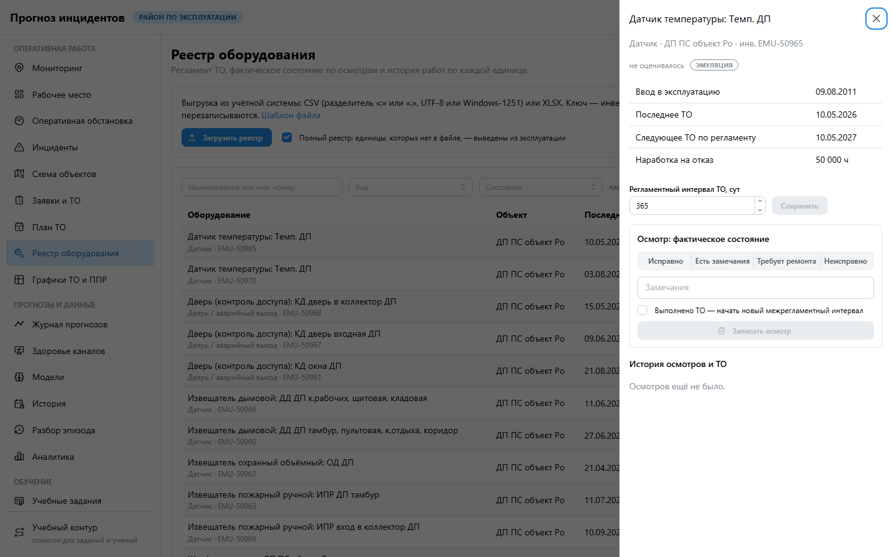
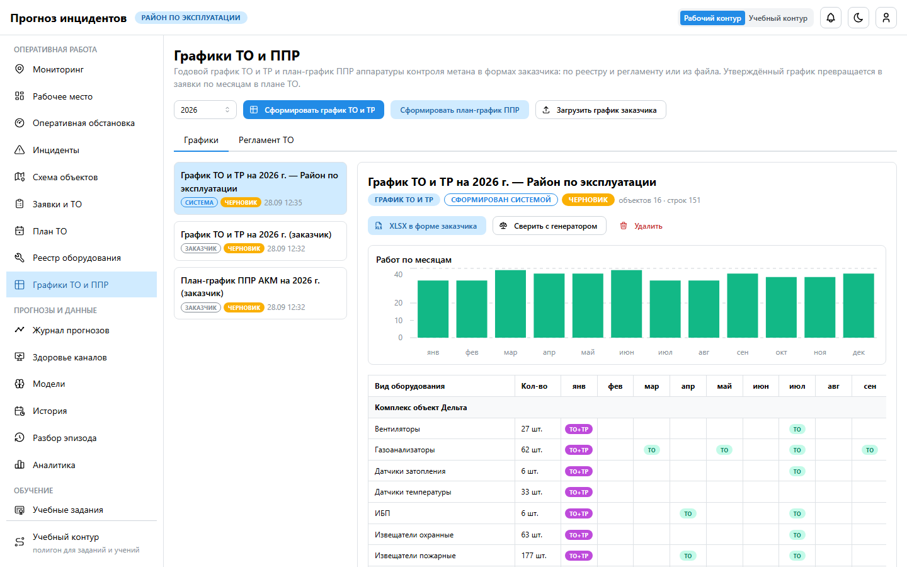
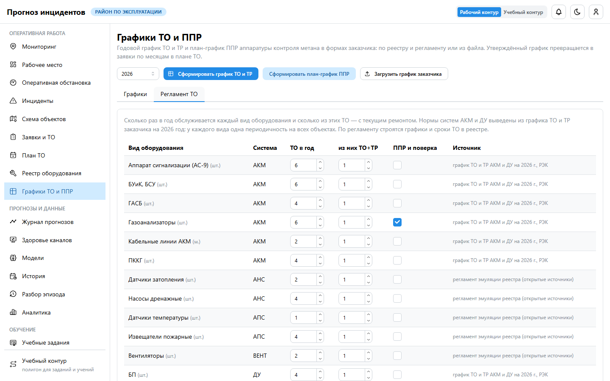

# Руководство пользователя: инженер ТО

**Для кого.** Инженеры по техническому обслуживанию. Вы планируете профилактические работы зоны
(ТЗ §3): что обслужить по регламенту, что — по состоянию оборудования и прогнозам, на какие даты.
Утверждает руководитель, выезжает бригада.

## 1. Рабочее место

«ТО просрочено» (и сколько из этого не в плане), «ТО в ближайшие 30 дней», «Рекомендации по
состоянию», «Требует ремонта», «Работ в плане»; список «Просрочено и не в плане».

## 2. План ТО

Раздел **«План ТО»**, горизонт 30, 90 или 180 дней:

| Вкладка | Что в ней |
|---|---|
| По регламенту | единицы, у которых срок ТО (последнее ТО + интервал) попадает в горизонт; просроченные — красным |
| По состоянию | рекомендации системы (прогноз отказа, газ, подтопление, Data Health) и оборудование в плохом состоянии |
| По графику | работы утверждённых графиков ТО и ТР и ППР на текущий и следующий месяц |
| Запланировано | заявки на работы с датами и исполнителями |

**«В план»** — выберите дату, вид работ и приоритет, появится черновик заявки. Руководитель его
утверждает, исполнитель — бригада зоны объекта. **«План в XLSX»** — выгрузка плана.

## 3. Реестр оборудования

- Регламент ТО, фактическое состояние и история осмотров каждой единицы.
- **Записать осмотр**: исправно / есть замечания / требует ремонта / неисправно, замечания. Отметка
  «Выполнено ТО» начинает новый межрегламентный интервал.
- **Добавить единицу** — если её нет в реестре заказчика (ручные записи синхронизация не трогает).
- **Загрузить реестр** — выгрузка учётной системы (CSV/XLSX) по шаблону.

## 4. Графики ТО и ППР

Раздел **«Графики ТО и ППР»** — документы в формах заказчика на год.

1. **Сформировать график ТО и ТР**. Система берёт оборудование зоны по видам и регламенту и
   распределяет работы по месяцам: у объекта один месяц ТО+ТР, остальные ТО с равным шагом,
   нагрузка по месяцам выравнивается.
2. **Сформировать план-график ППР** датчиков метана: партии, демонтаж, сдача в ОМ до 9:00
   следующего рабочего дня, вывоз, комиссия — по рабочим дням, равномерно по году.
3. **Загрузить график заказчика** (XLSX): форма и год определятся сами. «Сверить с генератором»
   покажет, совпадает ли периодичность и насколько ровнее нагрузка у системы.
4. **XLSX в форме заказчика** — готовый документ для печати на А4.
5. Отдайте график руководителю на **утверждение**. Работы утверждённого графика появятся в плане ТО
   на вкладке «По графику».

## 5. Регламент ТО

«Графики ТО и ППР» → «Регламент ТО»: по каждому виду оборудования — сколько ТО в год, сколько из них
с ТР, нужен ли ежегодный ППР с поверкой. Начальные нормы выведены из графика заказчика на 2026 год:
газоанализаторы — 6 ТО в год, МУСБ, ГАСБ, блоки питания — 4, кабельные линии — 2. Правка сохраняется
с пометкой «правка инженера ТО». Кнопка «Регламент из этого графика» пересчитывает нормы по
загруженному графику заказчика.

## 6. Фактическое состояние

Бригада, отмечая заявку выполненной, указывает состояние оборудования. Оно попадает в реестр,
ТО обновляет дату обслуживания. «Требует ремонта» и «неисправно» видны в плане сразу, а на следующие
сутки становятся рекомендацией с высоким или критическим приоритетом. Исправное состояние после
осмотра снимает рекомендацию.

## 7. Чего роль не делает

Не утверждает заявки и графики (руководитель), не исполняет работы (бригада), не работает с
карточками инцидентов.
