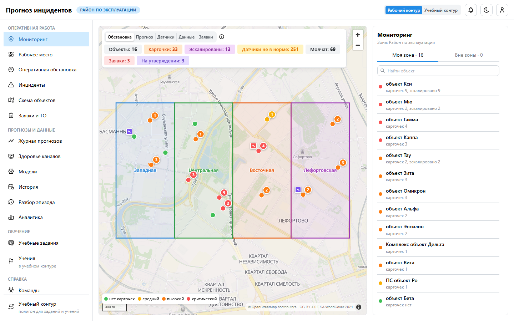
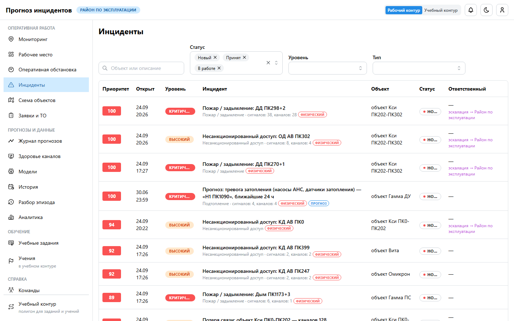

# Руководство пользователя: наблюдатель

**Для кого.** Сотрудники смежных служб и контролирующих подразделений, которым нужно видеть
обстановку, но не действовать. Вы видите всё в своей зоне ответственности и ничего не меняете.

## 1. Что доступно

| Раздел | Что видно |
|---|---|
| Мониторинг | карта зоны: объекты в цвете обстановки, карточки и заявки |
| Рабочее место | открытые карточки, высокий и критический уровень, высокий риск по прогнозу, молчащие каналы |
| Оперативная обстановка | поток сигналов, эпизоды, риски по пяти задачам |
| Инциденты | карточки с хронологией, решениями и проверкой по камерам |
| Журнал прогнозов | прогнозы с вероятностью, причинами и исходом |
| История, Разбор эпизода | показания за любой период, воспроизведение эпизода |
| Аналитика | сводки (без выгрузки) |
| Вики | регламенты и памятки |

## 2. Режимы работы

| Режим | Как включить | Для чего |
|---|---|---|
| Режимы карты | кнопки над картой «Мониторинг» | «Обстановка», «Прогноз», «Датчики», «Данные», «Заявки» — только просмотр |
| Спутник и этажи | кнопка со спутником; переключатель этажей справа | снимок местности, план этажа, прозрачность плана |
| Учебный контур | переключатель в шапке | полигон Мю, Кси, Тау: экскурсия по интерфейсу; на работу района не влияет |
| Телефон | адрес в браузере → «Добавить на главный экран» | просмотр обстановки |

## 3. Чего роль не делает

Не принимает и не решает карточки, не создаёт заявки, не меняет настройки. Кнопки действий
наблюдателю не показываются, API такие запросы отклоняет. Все просмотры карточек записываются
в журнал («Просмотрели карточку»).

## 4. Вопросы

- **Нужен доступ к действиям.** Роль назначает администратор (группа в AD или админка).
- **Не видно объекта.** Он вне вашей зоны — обратитесь к администратору.
