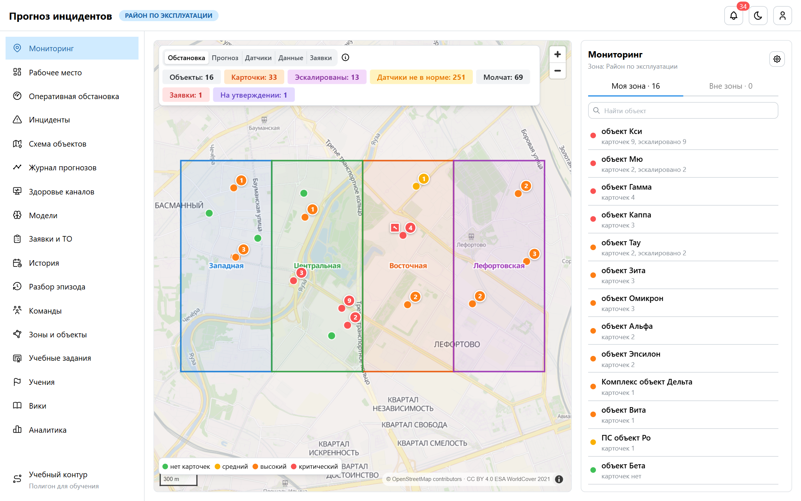
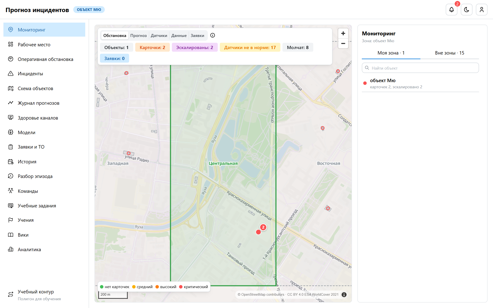
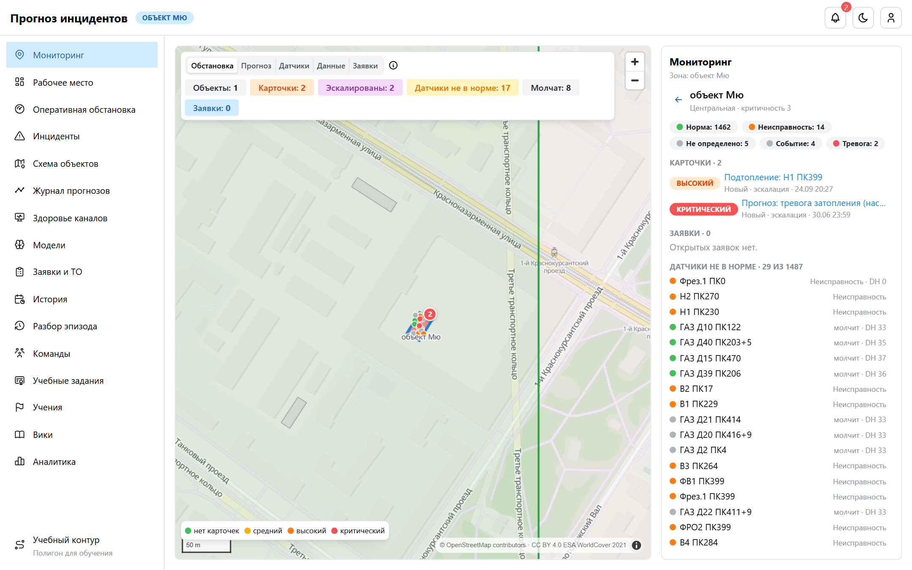
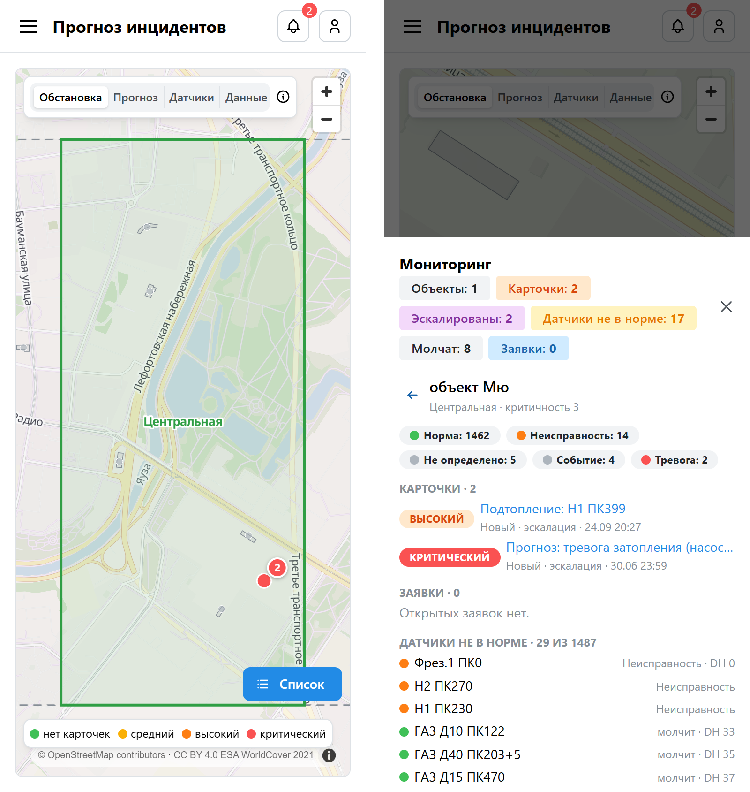
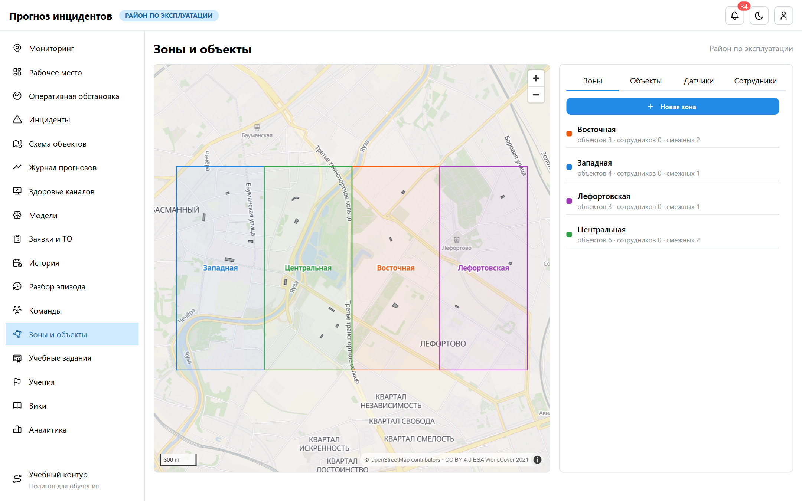
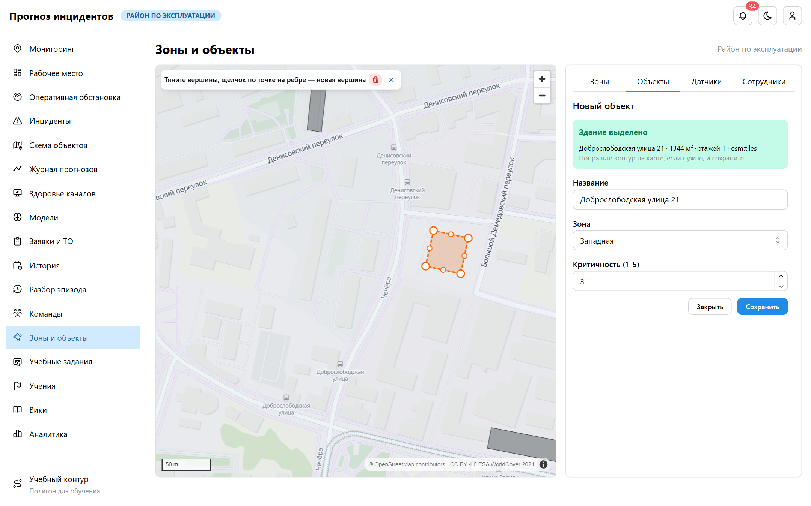

# Карта мониторинга, зоны ответственности и структура

**Мониторинг** — главный экран каждой роли. Он первым стоит в меню и открывается после входа. Это
интерактивная карта местности: зона ответственности пользователя выделена, объекты вне зоны показаны
второстепенно. Рядом с картой — то, что требует внимания роли. Рабочее место роли со схемой по
пикетам стало вторым пунктом меню (`/workspace`).

## Карта

- **Подложка.** Векторная карта OpenStreetMap (стиль MapLibre, по умолчанию сервер VersaTiles) в
  приглушённых тонах, светлая и тёмная, чтобы данные системы читались поверх неё. На карте только
  обязательная по лицензии данных пометка «© OpenStreetMap», логотипа и ссылки на движок нет.
  Leaflet не используется. Если сервер тайлов недоступен, карта через 8 с переходит на пустой фон:
  контуры зон и объектов, бейджи и датчики продолжают работать.
- **Зоны.** Своя зона залита цветом, граница толстая. Смежные зоны — пунктиром, остальные — тонким
  серым пунктиром. Зоны командирования выделены как свои.
- **Объекты.** Свои — здания в цвете режима. Вдали объект показан точкой, ближе — зданием, ещё ближе
  — с подписью. Объекты вне зоны серые, без цифр. У объектов смежной зоны красная обводка значит «есть
  открытые карточки»; подробности видит только их зона.
- **Бейджи.** Круг — число открытых карточек и их наивысший уровень. Ромб — заявки: синий — в работе,
  фиолетовый — ждут утверждения, красный — просрочены.
- **Датчики выбранного объекта.** Датчики не в норме видны всегда, датчики в норме — с 18-го
  масштаба: их сотни. Точка датчика берётся из его координат. Если координат нет, датчик
  раскладывается по главной оси здания по пикету, а по поперечной оси — по подсистеме.
- **Стартовый вид** — своя зона целиком. У районных ролей — весь район.

**Режимы раскраски** выбираются переключателем; доступны по правам:

| Режим | Кому | Цвет объекта |
|---|---|---|
| Обстановка | кто видит инциденты | наивысший уровень открытой карточки, зелёный — карточек нет |
| Прогноз | кто видит прогнозы | наивысший уровень прогноза риска по каналам |
| Датчики | все | доля каналов не в норме: есть — оранжевый, больше 10 % — красный |
| Данные | кто видит Data Health | каналы с Data Health ниже 40 и молчащие |
| Заявки | кто видит заявки (бригаде — только свои) | просроченные, на утверждении, в работе |

Режим по умолчанию: у диспетчеров, руководителя, наблюдателя и администратора — «Обстановка», у
аналитика — «Данные», у бригады — «Заявки».

**Боковая панель** (на телефоне — выезжает снизу по кнопке «Список»):
- «Моя зона» — свои объекты, отсортированные по серьёзности в текущем режиме, с поиском;
- «Вне зоны» — **второстепенные направления постранично** (по 10), смежные зоны первыми, с поиском.
  Щелчок переносит к объекту на карте, подробности закрыты;
- объект — состояния датчиков, открытые карточки (ссылки), заявки. Бригада берёт заявку в работу и
  отмечает выполнение прямо здесь. Ещё — датчики не в норме и ссылки на историю объекта и схему.

API:
- `GET /api/v1/analytics/monitoring/` — зоны, объекты с цифрами, маркеры, сводка, режимы и стиль
  подложки; кеш 30 с на пользователя;
- `GET /api/v1/analytics/monitoring/others/?page=&q=` — объекты вне зоны постранично;
- `GET /api/v1/analytics/monitoring/objects/{id}/` — объект. Вне зоны — только название и зона.

## Зоны ответственности

Зона — узел дерева объектов вида «зона» между районом и объектами: **район → зона → объект → части**.
Поэтому всё, что работает по поддереву, работает и для зон без доработок:
- видимость карточек, прогнозов, заявок;
- эскалация «объект → зона → район»;
- кеши, отчёты, метрики сотрудников.

Назначить сотрудника в зону — значит сделать её его зоной ответственности. Объект определяется по
виду узла, а не по глубине, поэтому объекты могут стоять и в зонах, и прямо под районом.

**Смежность.** Смежные зоны задаются вручную или подбираются по карте: контуры касаются или ближе
150 м. К смежным зонам сотрудников направляют обычным порядком; объекты смежных зон на карте видны
подробнее (признак «есть карточки»).

**Командирование.** Руководитель направляет сотрудника в другую зону на срок до 72 часов. На это
время сотрудник:
- видит карточки этой зоны — фильтр видимости берёт свою зону плюс зоны командирования;
- получает уведомления и эскалации этой зоны;
- не теряет свою зону.

В несмежную зону сотрудника можно направить только как **крайний случай**: с отметкой и
обязательной причиной, сотрудник получает срочное сообщение. Командирование можно отозвать, по
истечении срока доступ закрывается сам.

## Редактор «Зоны и объекты»

| Вкладка | Право | Роли |
|---|---|---|
| Зоны: граница на карте, цвет, смежность | `topology.manage_zones` | руководитель района, администратор |
| Объекты: контур здания, зона, критичность, перенос | `topology.add_node`, `change_node` | руководитель, аналитик, администратор |
| Датчики: новый канал, прикрепление к объекту или зоне, точка | `assets.add_channel`, `change_channel` | руководитель, аналитик, администратор |
| Сотрудники: зона ответственности, командирование | `accounts.assign_staff` | руководитель, администратор |

Всё — в пределах своей зоны ответственности. Каждое действие пишется в журнал (`structure.*`).

**Автовыделение здания.** «Новый объект» → щелчок по зданию:
1. Контур берётся из векторной подложки прямо в браузере — мгновенно, без внешнего запроса.
   Лишние вершины на стыке тайлов прореживаются.
2. Адрес здания дозапрашивается в фоне через Overpass API (OpenStreetMap).
3. Если в подложке здания нет (или она не загружена), контур запрашивает бэкенд у Overpass: здание,
   внутри которого точка, иначе ближайшее в радиусе 40 м.

Предложенный контур открывается в редакторе:
- тянуть вершины мышью или пальцем;
- щелчок по точке на середине ребра добавляет вершину;
- выбранную вершину удаляет кнопка с корзиной.

Название подставляется из адреса, зона — по месту. Критичность задаётся перед сохранением. Если
здания нет в данных — «Обвести вручную». Если контур объекта оказался вне границы зоны, после
сохранения показывается предупреждение.

**Датчики.** Датчик, заведённый вручную, получает ид канала из отдельного диапазона (от 80 000 001),
чтобы его нельзя было спутать с каналами СМВУ. Этот ид задаётся в системе мониторинга, чтобы пошли
данные. Датчик можно прикрепить к объекту, его части или прямо к зоне.

**Редактор контура** написан без плагинов, поверх того же движка карты. Контур проверяется на
сервере: замкнутое кольцо, от 3 до 2000 точек, допустимые координаты.

API: `/api/v1/topology/`:
- `structure/` — всё для редактора;
- `zones/`, `zones/{id}/`, `objects/`, `objects/{id}/`, `sensors/`, `sensors/{id}/`;
- `detect-building/?lon=&lat=`;
- `staff/{id}/assign/`, `staff/{id}/second/`, `secondments/{id}/recall/`.

## Привязка к местности

У заказчика координат объектов нет, справочник обезличен. Контуры задаются в редакторе. Для стенда
их засевает команда `seed_geo`, её вызывает `bootstrap` при `DEMO_USERS=true`:
- объекты ставятся на реальные здания OSM одного района Москвы, с отступом от границ зон;
- район режется на полосы-зоны, соседние полосы смежны;
- объекты демо-диспетчеров Мю и Кси — в одной зоне, Тау — в соседней, чтобы показать командирование;
- без сети — условные прямоугольники.

Команда идемпотентна: существующие зоны и контуры не трогает.

## Внешние обращения и настройка

| Что | Кто обращается | Что передаётся | Настройка |
|---|---|---|---|
| Тайлы, стиль (шрифты подписей для латиницы и кириллицы — свои, `frontend/public/map/glyphs`) | браузер пользователя | номер тайла (область карты) | `MAP_STYLE_LIGHT`, `MAP_STYLE_DARK`; адрес сервера для CSP — `MAP_TILES_ORIGIN` |
| Контур и адрес здания | бэкенд | координата щелчка | `OVERPASS_URL`; пусто — автовыделение по Overpass выключено |

В контуре заказчика оба адреса меняются на собственные серверы: тайлы OSM и Overpass
разворачиваются внутри сети. Без них карта работает на пустом фоне, а контуры обводятся вручную.
Варианты и настройка — в инструкции по развёртыванию (`docs/deployment.md`, раздел 6.3).
Данные системы (объекты, карточки, датчики) во внешние сервисы не передаются.
